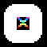
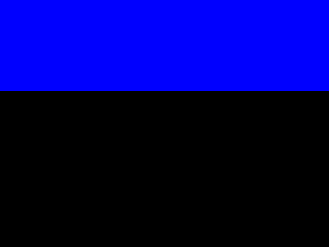
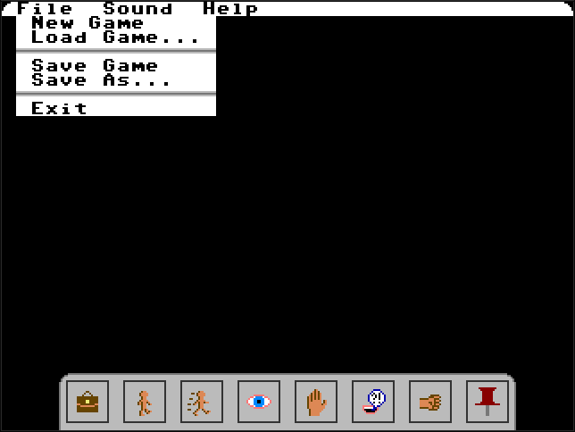
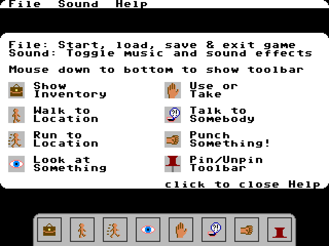
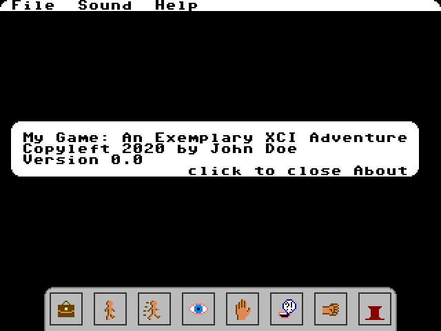
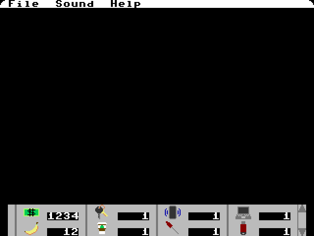
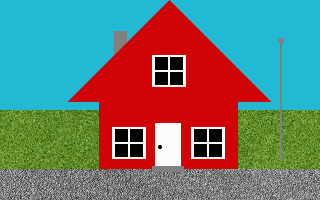
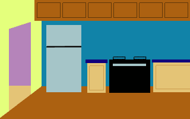
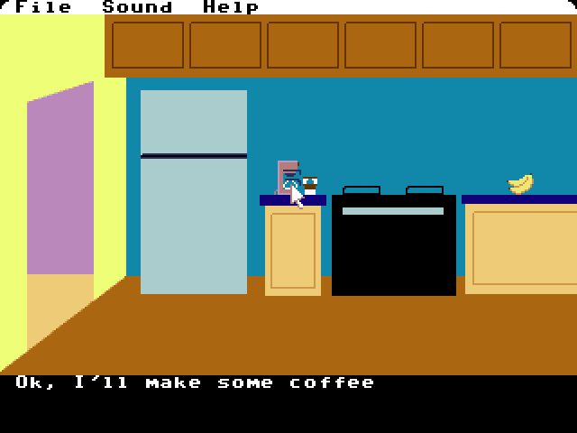

# XCI: eXtremely Compact Interpreter
An adventure game engine for the Commander X16

## Overview
XCI is an adventure game engine designed to be as compact as
possible while still creating a rich experience, featuring a
point-and-click interface, animated sprites, and detailed backgrounds.
This is being designed specifically for the Commander X16
retrocomputer, which has just over 37kB of base RAM, 512kB of
extended RAM split into 8kB banks, and 128kB of VRAM. It uses a
65C02 CPU, standard PS/2 mouse and keyboard, and an FPGA-based
video adapter (VERA) that can output 256 colors at a 640x480 resolution.
Because of the memory restrictions, XCI will be using 16 colors
per element at a 320x240 resolution. The X16 allows elements
to have a palette offset to choose which "row" of 16 colors from
the 256-color palette will be used.

The elements of the game consist of three independent layers:
* 320x200 Bitmap backgound, placed 8 pixels from the top of the screen, then end 32 pixels from the bottom. The entire bitmap
will comprise of only 16 colors, taken from a palette offset.
* 40x30 map of 8x8 tiles. Each tile can have 16 colors, but also
its own palette offset. The tiles provide a menu at the top of the
screen, text display and controls at the bottom. Tiles may also
act as static overlays on top of the background. Up to 720 unique
tiles can be defined.
* 128 individual 16x16 sprites, including a dynamic mouse cursor.
Each sprite can have 16 colors, from its own palette offset. Up to 512 unique sprite frames can be defined. All sprites except for the mouse cursor are confined to the bitmap area, and support collision
with other sprites and tiles. The mouse cursor is context-sensitive,
changing its frame based on its position and game state to indicate
the type of action that will happen when the mouse button is clicked.

## Memory Map
Main RAM ($0801-$9EFF): XCI engine code, top-level game data (starting at $6000)

Banked RAM ($A000-$BFFF): 6 banks per level, up to 10 levels per currently loaded zone.
* Bank 0: Kernal Use
* Bank 1: Zone level 0 configuration data (title screen music at start)
* Banks 2-5: Zone level 0 background bitmap
* Bank 6: Zone level 0 music and sound effects
* Bank 7: Zone level 1 configuration data

...
* Bank 60: Zone level 9 music and sound effects
* Bank 61: Sprite animation sequences
* Bank 62: Sprite movement progress and vectors
* Bank 63: State flags


When transit from a level leads to a different zone, the new
zone is loaded to banked RAM from the file system. Up to 256
different zones can be defined.

VRAM:
* Bank 0: Bitmap ($0000-$95FF), Tile Map ($9600-$A5FF), Tiles ($A600-$FFFF)
* Bank 1: Sprites ($0000-$FFFF)

## Data Format
All game data is described in text files, starting with a main file. This file defines the top-level game data, providing references to all other source files. Its filename is the only input to the build utility (**xci.exe**). It is simply a set of key-value pairs. There are certain mandatory keys that are required for the game to be successfully built. Unrecognized keys are ignored by the build utility, as are comments, which begin with a hash (```#```) symbol. Keys have no spaces and are not case-sensitive, but values may be case-sensitive and consist of all text after the first whitespace after the key up to the end of the line or the start of a comment. New lines can be part of a value by using the escape code ```\n```. A value can contain a hash character by escaping it with a backslash (i.e. ```\#```). And if a value contains a backslash character, that can be escaped with a double backslash (```\\```).

### Main File
The following is an example of a main file, showing all required keys.

```
# This is a comment
title My Game
author John Doe
palette mygame_pal.hex
tiles_hex mygame_tiles.hex
sprites_hex mygame_sprites.hex
menu_xci mygame_menu.xci
title_screen mygame_start.xci
init_cursor 0 # sprite frame index
zone mygame_zone0.xci # the first zone defined will be loaded first,
                      # with its first level the start of the game
zone mygame_zone1.xci
zone mygame_zone2.xci
```

Let's say this file is named **mygame.xci**. The game can be built by passing it to the build utility, as follows:

```
$ /path/to/xci.exe mygame.xci
```

If it finishes without errors, the game is built! Let's assume that zone 0 has 2 levels, zone 1 has 3 levels, and zone 2 a full 10 levels. The following binaries will be generated:

* **MAIN.BIN** - This is the compiled version of **mygame.xci**. This will be loaded into base RAM by the XCI program (**XCI.PRG**) at run time. This and all binaries generated by the build utility (in addition to **XCI.PRG**) need to be loaded into the X16 file system to run the game. It will contain information from **mygame.xci** and other files specified by the main file keys.
* **PAL.BIN** - This is the initial palette for the game, as specified by the filename after the **palette** key (**mygame_pal.hex**) and other configuration data. It will be loaded by the XCI program into VRAM (F:1000) prior to displaying the title screen. Note that the palette beyond index 15 will be modified as different parts of the game are loaded.
* **TILES.BIN** - This is the binary version of **mygame_tiles.hex**, which contains the tile set for the game, as specified by the **tiles_hex** key. It will be loaded by the XCI program into VRAM (0:A600) prior to displaying the title screen.
* **SPRITES.BIN** - This is the binary version of **mygame_sprites.hex**, which contains the sprite frames for the game, as specified by the **sprites_hex** key. It will be loaded by the XCI program into VRAM (1:0000) prior to displaying the title screen.
* **TTL.BM.BIN** - This is the background bitmap for the title screen, specified by the contents of **mygame_start.xci**, which will be explained later. It will be loaded into VRAM (0:0000) once the palette, tiles and sprites are all loaded. Unlike the background bitmaps of the game levels, this bitmap can take up the full screen (320x240). This will remain in VRAM and on screen until the player starts a new game or loads a saved game. It is never stored in base or banked RAM.
* **TTL.MUS.BIN** - This is the music for the title screen, specified by the contents of **mygame_start.xci**. It will be loaded into bank 1 of banked RAM for only the duration of the start screen. Once the first game zone is loaded, it will not be in memory again.
* **Z000L0.01.BIN** - This is the configuration data for level 0 of zone 0. This is the first level that will be loaded after starting a new game. It is defined by the contents of **mygame_zone0.xci**, as specified by the first instance of the **zone** key. It will be loaded into bank 1 of banked RAM whenever the game enters level 0 (as it does when starting a new game, but a saved game may have also left off in level 0).
* **Z000L0.02.BIN** - This is the background bitmap for level 0 of zone 0, specified by the contents of **mygame_zone0.xci**, which will be explained later. It will be loaded into banks 2-5 of banked RAM whenever the game enters zone 0, and into VRAM when the game enters level 0. Because of the in-game screen layout, this bitmap will start 8 pixel9s from the top, and therefore starting at VRAM address 0:0500. From 0:0000 to 0:04FF will be zero-filled, as it lies behind the menu bar. From 0:7D00 to 0:95FF will be zero-filled, as it lies behind the text field/toolbar.
* **Z000L0.06.BIN** - The music and sound effects for level 0 of zone 0. The length of the music and addresses for each sound effect are defined in the level configuration data. This file will be loaded into bank 6 when the game enters zone 0. They data will be played directly from banked RAM when the game enters level 0.
* **Z000L1.07.BIN** - This is the configuration data for level 1 of zone 0. It will be loaded to bank 7 when the game enters zone 0.
* **Z000L1.08.BIN** - This file contains the background bitmap for level 1 of zone 0. It will be loaded into banks 8-11 when the game enters zone 0, and into VRAM starting at 0:0500 when the game enters level 1.
* **Z000L1.12.BIN** - The music and sound effects for level 1 of zone 0. It will be loaded to bank 12 when the game enters zone 0. It is also the last file to be loaded into banked RAM for zone 0, as it only contains two levels. When starting a new game, or loading a game that left off in zone 0, the rest of the files below will not be loaded from the file system at the beginning of game play.
* **Z001L0.01.BIN, Z001L0.02.BIN, Z001L0.06.BIN** - All data for level 0 of zone 1. These will be loaded into banks 1-6 when the game enters zone 1.
* **Z001L1.07.BIN, Z001L1.08.BIN, Z001L1.12.BIN** - All data for level 1 of zone 1. These will be loaded into banks 7-12 when the game enters zone 1.
* **Z001L2.13.BIN, Z001L2.14.BIN, Z001L2.18.BIN** - All data for level 2 of zone 1. These will be loaded into banks 13-18 when the game enters zone 1. They are the last files to be loaded into banked RAM for zone 1.
* **Z002L0.01.BIN, Z002L0.02.BIN, Z002L0.06.BIN** - Zone 2, level 0
* **Z002L1.07.BIN, Z002L1.08.BIN, Z002L1.12.BIN** - Zone 2, level 1
* **Z002L2.13.BIN, Z002L2.14.BIN, Z002L2.18.BIN** - Zone 2, level 2
* **Z002L3.19.BIN, Z002L3.20.BIN, Z002L3.24.BIN** - Zone 2, level 3
* **Z002L4.25.BIN, Z002L4.26.BIN, Z002L4.30.BIN** - Zone 2, level 4
* **Z002L5.31.BIN, Z002L5.32.BIN, Z002L5.36.BIN** - Zone 2, level 5
* **Z002L6.37.BIN, Z002L6.38.BIN, Z002L6.42.BIN** - Zone 2, level 6
* **Z002L7.43.BIN, Z002L7.44.BIN, Z002L7.48.BIN** - Zone 2, level 7
* **Z002L8.49.BIN, Z002L8.50.BIN, Z002L8.54.BIN** - Zone 2, level 8
* **Z002L9.55.BIN, Z002L9.56.BIN, Z002L9.60.BIN** - Zone 2, level 9. These are loaded into banks 55-60, the highest RAM banks that can be populated by an XCI game, when the game enters zone 2.

Wow, that's a lot of files! But most of them are 32kB or smaller. Each zone would easily fit on a single double-density 3.5" floppy, to put it in perspective. In this case, the whole game maxes out at 870kB (and that's assuming very complicated title screen and levels, and all available sprite frames and tiles defined), which would fit on a single high-density floppy, 2 double-density 3.5" floppies, or 3 double-density 5.25" floppies. The biggest XCI game possible would be 125MB, or 87 high-density 3.5" floppies. A CD-ROM could hold at least 5 XCI games. A 2GB SD Card could hold at least 16. Of course, it is highly unlikely that even the most prolific storyteller could come up with 2550 levels for a single game, so most games should clock in at around 5MB, which means that an X16 user could play hundreds of XCI games without changing their SD card. Because of filename conflicts, each game would need to be in a separate directory.

#### Main File: Required Keys

The following are the required keys for the main file. Any keys outside of these will be ignored. If any of these are missing from the main file or have values that are formatted incorrectly, the game will fail to build. Please note that your development platform may have a case-sensitive file system (e.g. Linux, Mac), so the capitalization of filename values matters. Meanwhile all keys are not case-sensitive, but they must be spelled correctly and be immediately followed only by whitespace and then the value. This is the case for all XCI configuration files.

* **title** - Title of the game, will be printed to console when graphics data is loading. The maximum length is 255 characters, and it will be placed at the very beginning of **MAIN.BIN**. It is recommended that this include a version number, as a modified game configuration will most likely break compatibility with older saved game files.  When loading a saved game, the engine will verify that the title in the game file matches the current configuration.
* **author** - Author of the game, which will also be printed to the console.  The maximum length is 255 characters, and it will be placed 256 bytes into **MAIN.BIN**, after the space reserved for the title. The title and author will also be the main meta data to discriminate between different instances of **MAIN.BIN**. When loading a saved game, the engine will verify that the author matches the current configuration.
* **palette** - Filename of the hex file containing the initial palette. The format of this file will be explained in the [Palette Hex File](#palette-hex-file) section. This file must be in the same directory as the main file, or the value must contain the path to the file. This applies to all filename values in XCI configuration source files.
* **tiles_hex** - Filename of the hex file containing the tile definitions. The format of this file will be explained in the [Tiles Hex File](#tiles-hex-file) section.
* **sprites_hex** - Filename of the hex file containing the sprite definitions. The format of this file will be explained in the [Sprites Hex File](#sprites-hex-file) section.
* **menu_xci** - Filename of the menu file, another XCI configuration file like the main file.  The format of this file will be explained in the [Menu File](#menu-file) section.
* **title_screen** - Filename of the title screen file.  The format of this file will be explained in the [Title Screen File](#title-screen-file) section.
* **init_cursor** - Sprite frame used as the initial mouse cursor.  The sprite frames start with index zero, which is the first 16x16 bitmap defined in **SPRITES.BIN**. This value must be between 0 and the highest sprite frame index, which could be as high as 511, depending on the size of **SPRITES.BIN**.
* **zone** - This is the only key which can have more than one instance in the main file. The first instance will be for filename of the zone file that will be used for zone 0. The remaining instances will determine the index order for all zone files, from 1 up to 255. Any **zone** instances past the 256th will be ignored. The format for these files will be explained in the [Zone Files](#zone-files) section.

### Hex Files
Hex files are a human-friendly way of specifying binary data. Every four bits of data are represented by a single hexadecimal digit, represented as an ASCII character, ```0``` through ```9``` and ```A``` through ````F````, representing the binary values of 0000 through 1111, or 0 through 15 in decimal. The format of the binary data specified by hex files is determined by the X16's VERA video adapter, which is documented in the [VERA Programmer's Reference](https://github.com/commanderx16/x16-docs/blob/master/VERA%20Programmer's%20Reference.md). The binary files generated from the hex files will be loaded directly into VRAM and the contents are not verified in any way.

Like XCI configuration files, hex files can contain comments starting with ```#```, which may be at the very beginning of a line, or after a line of hex characters.  If any non-hex or non-whitespace characters appear on a line before a ```#```, the game will fail to build.  Hex files are not case sensitive at all, so upper and lowercase letters are interchangeable for ```A``` through ```F```.

Whitespace can be used however the developer sees fit, separating each byte with a space, or just having a whole block of hex characters uninterrupted. The only limitations are that each byte must have its pair of characters adjacent (no splitting with whitespace or new lines) and each line may be no more than 1000 characters wide. The following is an example of a valid hex file.

```
# Header comment
12 34 56 78       # Bytes
9ABC DEF0         # Words
13579BDF 02468ACE # double words
```

To be loadable by the X16, binary files require a two-byte header, which is effectively ingored, so the binaries build from hex files will always start with two null, or zero bytes. The following table shows byte-by-byte what will be written to a binary file that would be build from the above hex file. Note that the hex files have no concept of "endianness" based on the whitespace; each 4-bit nibble will be written out in binary in the order they are read from hex characters.

| Hex | Binary | Decimal | Notes     |
|-----|--------|---------|-----------|
|   00|00000000|        0|Ignored, but required by X16|
|   00|00000000|        0|Ignored    |
|   12|00010010|       18|From line 1, this is the first actual byte that will be loaded to VRAM|
|   34|00110100|       52|           |
|   56|01010110|       86|           |
|   78|01111000|      120|           |
|   9A|10011010|      154|From line 2|
|   BC|10111100|      188|           |
|   DE|11011110|      222|           |
|   F0|11110000|      240|           |
|   13|00010011|       19|From line 3|
|   57|01010111|       87|           |
|   9B|10011011|      155|           |
|   DF|11011111|      223|           |
|   02|00000010|        2|           |
|   46|01000110|       70|           |
|   8A|10001010|      138|           |
|   CE|11001110|      206|This is the last of 16 bytes that will be loaded to VRAM|

Now, we will see what each of the hex files should contain.

#### Palette Hex File
The initial palette hex file may contain all 256 colors, but only the first 16 colors will be read, as the rest will be modified by the configuration and during runtime.  This is in the format specified by the VERA documentation: two bytes for each color, with 4 bits for each of red, green and blue and four unused bits.  This means that a single hex character represents each color component from 0 to F (15 decimal). In binary, the two-byte field is formatted as ```bbbbgggg 0000rrrr```. So, pure white would be ```11111111 00001111``` in binary, or ```FF 0F``` in hex. So, 16 colors would be simply 64 hex characters.

The following example shows how a hex file would specify the first 16 colors of the default X16 palette.

```
# Default X16 palette, offset 0
0000 FF0F 0008 FE0A 4C0C C500 0A00 E70E 850D 4006 770F 3303 7707 F60A 8F00 BB0B
```

When VERA elements are using 16 colors (as all elements in XCI game do), the color is specified by a four-bit value, or a single hex digit, representing 0 through 15. Despite how the palette may be configured, color 0 of every palette offset is transparent, so it might as well be black, as shown above. As we can see, the next color value is white, which is color index 1. So, a bitmap where each byte is hex ```01``` would have alternating transparent and white pixels. Looking down the palette, we can see that color index 2 is a medium red, as the blue and green values are set to zero, but the red value is set to 8, which is the middle intensity between 1 and 15. Making each byte of a bitmap hex ```12``` would have alternating white and red pixels, with no transparency. We will see more concrete examples of hex-encoded bitmaps in the next two sections, which will assume the default palette.

#### Tiles Hex File
The tiles for XCI games are 8x8 pixels, with 4 bits per pixel. So, for the hex file, each hex character will represent a pixel of a tile, and 64 characters (32 bytes) are required to define one tile. XCI allows for up to 720 different tiles to be defined in this file, but at least 177 need to be defined. This is because tile indices 32 (space) through 176 (tilde) will be an ASCII character font. Included with the XCI development kit is an example tile set that defines a default character font and some other basic tiles that are needed for the menu and toolbar. But, you are completely free to redefine all of them, just remember the usage of those ASCII character tiles for the menu and text field is fixed. Also, the characters should use color 1 for their foreground and 6 for their background, just like the initial X16 BASIC screen, so that the configuration can effectively switch out those colors in other palette offsets. If colors other than those are used in ASCII tiles, they will not chage their color values from palette offset 0.

Also note that while tiles being used for the menu, text field and tool will be using palette offset zero (or other palettes derived from it) as defined by the palette hex file, within the levels, any tile may be used with any of the palette offsets available in the current zone. This means that tiles (and sprites!) can be used as overlays on the level bitmap to add additional color depth. Tiles can also be flipped both horizontally and vertically.

The following is an example of the beginning of a tile set. Comments describe what each tile is supposed to be.

```
# Tile 0: Transparent
00000000
00000000
00000000
00000000
00000000
00000000
00000000
00000000

# Tile 1: Solid white square
11111111
11111111
11111111
11111111
11111111
11111111
11111111
11111111

# Tile 2: White square with rounded corner. Can be flipped to round different
#         different corners of a white box
11100000
11111000
11111100
11111110
11111110
11111111
11111111
11111111

# Tile 3: Commander X16 "Butterfly"
44000044
0EE00EE0
00333300
00055000
00777700
08800880
22000022
00000000
```

Using these tiles, we can build a little tile map that defines a rounded white box with the butterfly inside. The first tile we need is the upper-left corner. Tile 2 has the corner in the upper-right corner, so it will need to be flipped horizontally. Then, we need a white square (tile 1), and then the upper-right corner, where we can use tile 2 without any flipping. That's the entire first row, so onto the second row, where we start with a white square for the left side, then the the butterfly (tile 3) and another white square for the right side. Finally, the last row starts with tile 2 flipped both horizontally and vertically to make the lower-left corner, one more white square, and then finishing with tile 2 flipped vertically to make the lower-right corner. The rest of the tile map will consist of tile 0, which is (and should always be for any game) transparent.

And here's what you get: 

Later on, we'll see how tiles are used to define the menu and toolbar, and how they can be added to game levels.

#### Sprites Hex File
All sprites for XCI games are 16x16 pixels, but since there are up to 128 sprites available for rendering at any time, larger sprites can be accomplished by synchronizing the movements of adjacent sprites. Each sprite can have 16 colors, and use any palette offset at any time.  Like tiles, sprites can add to the color depth of an image, with the added capability of being able to be placed at any position on screen.  The only required sprite is the mouse cursor, which must be sprite index 0. However, any sprite frame may be used for the mouse cursor, but its initial frame is determined my the **init_cursor** key in the main file.  Generally this should be a simple pointer cursor, but during game play the cursor can be context-sensitive, changing its frame based on its position and game state. Many games have a player avatar sprite, but that is not required for XCI. Sprite movements may be pre-programmed to happen once or loop through a level, or they could respond to mouse actions. Each frame of each sprite's potential movement needs to be defined, but like tiles, sprite frames can change their appearance through changing the palette offset or flipping horizontally, vertically or both.

Each sprite frame has an index, which is used to specify which frame any given sprite should be displaying according to the game configuration. Any sprite can use any of the frames, from index 0 through 511, or whatever the highest defined sprite index is in the hex file. The example below shows a very basic example of a sprite frame set. You may recognize the player avatar from [Chase Vault](https://github.com/SlithyMatt/x16-chasevault).

```
# frame 0: initial mouse cursor
f000000000000000
f100000000000000
f110000000000000
f111000000000000
f111100000000000
f111110000000000
f111111000000000
fff1100000000000
000f110000000000
000f100000000000
0000000000000000
0000000000000000
0000000000000000
0000000000000000
0000000000000000
0000000000000000
# frame 1: player avatar standing, side
0000000977000000
0000007797700000
0000079779977000
0000077997700000
0000999776a00000
0000777aaaaa0000
000070aaaaa00000
0000000aaa000000
0000009997700000
0000095775500000
0000995775500000
00009959a5500000
0000999555000000
0000000990000000
0000000990000000
0000000bbb000000
# frame 2: player avatar walking 1, side
0000000977000000
0000007797700000
0000079779977000
0000077997700000
0000999776a00000
0000777aaaaa0000
000070aaaaa00000
0000000aaa000000
0000009997700000
0000095777500000
0000995577500000
000099595a500000
0000999555000000
0000000999000000
00000b99099b0000
000000bb0bb00000
# frame 3: player avatar walking 2, side
0000000977000000
0000007797700000
0000079779977000
0000077997700000
0000999776a00000
0000777aaaaa0000
000070aaaaa00000
0000000aaa000000
0000009997700000
00000957777a0000
0000995597700000
0000995955500000
0000999555000000
00000b99999b0000
00000b90009b0000
000000b000b00000
# frame 4: player avatar walking 3, side
0000000977000000
0000007797700000
0000079779977000
0000077997700000
0000999776a00000
0000777aaaaa0000
000070aaaaa00000
0000000aaa000000
0000009997700000
0000097775500000
0000997795500000
0000995a55500000
0000999555000000
0000000999000000
00000b99099b0000
000000bb0bb00000
# frame 5: player avatar walking 7, side
0000000977000000
0000007797700000
0000079779977000
0000077997700000
0000999776a00000
0000777aaaaa0000
000070aaaaa00000
0000000aaa000000
0000009997700000
0000077795500000
0000a77795500000
00009959a5500000
0000999555000000
00000b99999b0000
00000b90009b0000
000000b000b00000
```

These 6 sprite frames are enough to have a mouse cursor and a player avatar that can walk from side to side. Frames 1-5 have the avatar facing right, but they each can be flipped horizontally to walk to the left.  

With a [simple BASIC program](example/sprite.bas), we can test both the mouse sprite and do a little animation with the avatar: 

Notice that the mouse pointer has its point in the upper left corner of the frame. This is because that corner pixel is the actual mouse position. This goes for all sprites, where the position specified will be its upper-left corner, so make sure that there is room below and to the right of the position to display the portion of the sprite you want visible.  We'll see how to do this later when configuring game levels.

### Menu File
The menu file is a key-value configuration text file, just like the main file.  This one defines the appearance and behavior of the menu bar, which occupies the top 8 pixel rows of the screen, as well as the toolbar, which can appear at the bottom of the screen. It is also used to define how text is rendered during the game. These elements are all rendered completely with tiles and using only palette offset 0 to maintain consistency throughout the game. The example menu file and tiles provide the basis for any game, but you can customize them however you want for your own game. The example menu file (**mygame_menu.xci**) is shown below.

```
# Menu bar definition
menu_bg 1 # background color = white
menu_fg 0 # foreground color = black
menu_lc 2H
menu_sp 1
menu_rc 2
menu_div 4
menu_check 157
menu_uncheck 158
menu File
menu_item new
menu_item load
menu_item div
menu_item save
menu_item saveas
menu_item div
menu_item exit
menu Sound
menu_item music
menu_item sfx
menu Help
menu_item controls
menu_item div
menu_item about

controls mygame_help.txt
about mygame_about.txt

# text styles
text1_bg 0 # text style 1 background color = black
text1_fg 1 # text style 1 foreground color = white
text2_bg 0
text2_fg 7 # yellow
text3_bg 0
text3_fg 14 # light blue

# Toolbar definition
tb_dim 32 4
tool inventory
tool_tiles 5H 6 6 9 7 20 20H 8H 7 21 21H 8H 10 11 11 12H
tool walk
tool_tiles 9H 6 6 9 8 13 14 8H 8 15 16 8H 12 11 11 12H
tool run
tool_tiles 9H 6 6 9 8 17 14 8H 8 18 19 8H 12 11 11 12H
tool look
tool_tiles 9H 6 6 9 8 22 22H 8H 8 22V 22HV 8H 12 11 11 12H
tool use
tool_tiles 9H 6 6 9 8 23 24 8H 8 25 26 8H 12 11 11 12H
tool talk
tool_tiles 9H 6 6 9 8 27 28 8H 8 29 30 8H 12 11 11 12H
tool strike
tool_tiles 9H 6 6 9 8 31 127 8H 8 128 129 8H 12 11 11 12H
tool pin
tool_tiles 9H 6 6 5 8 130 130H 7H 8 131 131H 7H 12 11 11 10H # pin out
tool_tiles 9H 6 6 5 8 132 132H 7H 8 133 133H 7H 12 11 11 10H # pin in

inventory mygame_inv.xci
walk 15
run 16
look 17
use 18
talk 19
strike 20
```

When the build utility loads this file (as it was referenced from the main file), it will add data to the main binary file (**MAIN.BIN**) to contain all of this configuration information, with the exception of the text color settings, which result in palette modifications.  The different key specifications will explain how all of the values are used.

What this file gets you, with the complete example tile set (built from **mygame_tiles.hex**), is a menu and toolbar that look like this: 

So how does XCI take the menu file and make that screen? Let's go through each of the required keys for it.  Just like with the main file, all of these keys need to be present, but after that we'll go through the optional keys that can be in there, whcih are also in the example. Any keys that aren't expected are ignored, just as if they were comments. If any of the values are invalid, the build will fail.

#### Menu File: Required Keys
* **menu_lc** - Tile used for left corner of menu bar.  Tile values consist of the index (in decimal) followed by an optional set of letters. If there are no letters after the number, then the tile is displayed normally. If it is followed by an ```H```, it is flipped horizontally. If it is followed by a ```V```, it is flipped vertically. If it is followed by ```HV```, it is flipped both horizontally and vertically. In the example, it has a value of ```2H```, which means that rounded corner tile we saw before will be used, flipped horizontally.
* **menu_sp** - Tile used for empty space of menu bar. In the example, the plain white square tile (```1```) is specified.
* **menu_rc** - Tile used for right corner of menu bar. In the example, the rounded corner is used again, without any flipping (```2```).
* **menu** - This specifies the name of a menu, which will be rendered using the value's ASCII text, which can be no longer than 16 characters. The menu file needs to have at least one menu defined, but no more than 5. The menus will be rendered in the order they appear in the menu file, from left to right. The menu will contain all the items specified until the next **menu** key or the end of the file. In the example, the menus defined are ```File```, ```Sound```, and ```Help```. As you can see in the image, the menu bar starts with the left corner tile, followed by the first menu title, then two space tiles, the second menu tile, two more space tile, the last menu tile, enough spacees to fill through the 39th tile space, and finally the right corner tile at the 40th tile space, which is the extreme right end of the visible tiles. Note that the tile map is actually 64 tiles wide in VRAM, but only the first 40 columns are ever visible. When a menu is clicked, it will appear underneath the menu bar. Each item will be preceded by a space tile (unless it's a divider item), followed by the ASCII label for the item, and finally enough space tiles to fill out the menu. The menu width is determined by the longest label among its items, being its width plus 2, to accomodate space tiles on either side of the label. In the example, as seen in the above image, the ```File``` menu is shown, which has ```Load Game...``` as its widest item label, making the total width of the menu 14 tiles.
* **menu_item** - This specifies an item to include in a menu. The items specified in this file will be placed in the last specified menu in order from top to bottom, with a maximum of 9 items per menu. The values available for items must come from one of the identifiers supported by XCI, but a game only needs to support a subset of these, however it must have at least one non-divider item per menu. The following identifiers are supported:
   * **new** - Rendered as "New Game". This is will start a new game with no progress at zone 0, level 0. If a game is in progress, the player will be prompted to save their game.
   * **load** - Rendered as "Load Game...". This will prompt the player with a list of available saved games to load. The saved game will resume at the last visited level with all progress attained at the time it was saved.
   * **save** - Rendered as "Save Game". This will overwrite th current saved game file. If the current session started from a new game and was never saved before, the player will be prompted for a new filename.
   * **saveas** - Rendered as "Save As...". This will prompt the player for a new filename to save the game. This gives the player the ability to maintain multiple restore points in case they are unsure about their most recent progress.
   * **exit** - Rendered as "Exit".  Will prompt the player with the option to save the game before exitting. This will ultimately trigger a soft reset to bring the player back to the BASIC start screen. It is highly recommended that the a menu contains this item.
   * **music** - Rendered as "Music" preceded by a space for a checkmark. By default, music is turned on, and the checkmark will be displayed. Selecting the item will toggle the checkmark. The state of this item will be stored in the saved game file so that when the game is reloaded the state will be restored to the player's preference. If this item is included in the menu file, the **menu_check** key needs to be included.
   * **sfx** - Rendered as "Sound Effects" preceded by a space for a checkmark. Toggles the enabling of sound effects, which is also maintained in saved games. It also requires the **menu_check** key.
   * **controls** - Rendered as "Controls". Blacks out the level bitmap and displays the controls guide. This requires the **controls** key to be defined, which will specify the source file for the guide.
   * **about** - Rendered as "About". Blacks out the level bitmap and displays information about the game. This requires the **about** key to be defined, which will specify the source file for the about screen.
   * **div** - Rendered as the divider tile for the width of the menu. Generally is placed between other items to provide visual grouping of similar items. Requires the **menu_div** key to define which tile to use.
* **tb_dim** - Dimensions of the toolbar, in tiles. The first number is the width, which must be at least as many tiles as there are tools specified, but no more than 40. The second number is the height, which must be between 1 and 4. Must precede any **tool** keys.
* **tool** - Tool to include on the toolbar. At least one tool must be included. Value must be one of the identifiers of a supported XCI tool. The following tools are supported:
    * **inventory** - Replaces the toolbar with the inventory bar. Requires the **inventory** key to specify the inventory configuration file. When an item is selected from the inventory, the mouse cursor will change to a frame specified in the inventory file and the inventory bar will disappear. Then the player can attempt to use the item on a location within the level by clicking the mouse over the location. Each of these values (except for **inventory** and **pin**) has an identically named optional key for specifying the sprite frame that the mouse cursor will change to. If the corresponding key is not specified, then the mouse will use the default cursor frame when that tool is selected.
    * **walk** - Lets the player select a location for their avatar to attempt to walk to.
    * **run** - Lets the player select a location for their avatar to attempt to run to.
    * **look** - Lets the player select a location to look at and get some information.
    * **use** - Lets the player select a location to attempt to use "bare-handed" (without an inventory item). Generally useful for things like opening doors and picking up new items.
    * **talk** - Lets the player select a location (presumably occupied by a character or listening device) to talk to.
    * **strike** - Lets the player select a location (presumable occupied by an enemy or something that just needs punching) to strike with its hand or whatever weapon is available.
    * **pin** - Lets the player toggle whether the toolbar is pinned in place. By default, when the toolbar first appears (by moving the mouse cursor to the bottom of the screen), the pin is "out", allowing the toolbar to disappear when the mouse cursor leaves it. If the pin is toggled to "in", the toolbar will stay visible until the pin is "pulled out" again. The first **tool_tiles** key after this defines the appearance of the pin being out. The pin tool then requires a second **tool_tiles** in the menu file before the next **tool** key or the end of file, which will define the appearance of the pin being in.
* **tool_tiles** - Tiles used for the preceding tool's toolbar button.  Unlike other tile keys described before, this one takes an ordered set of tile indexes (potentially with H and/or V appended for flipping) to define the button area.  Toolbar buttons may have variable widths, but the height is fixed at the value of the height of **tb_dim**. In the example menu file, the height is set to 4, so the tiles must be laid out in multiples of 4. So, if 4 tiles are specified, the button is 1 tile wide. In the example, each button specifies 16 tiles, so they are each 4 tiles wide.  The tiles are in left-down order, so that the first 4 are the top row, then the next 3 rows to the bottom.  The total number of tiles for all buttons should be the **tb_dim** height x width. In the example, this means that there are 4x32, or 128 tiles across all 8 buttons. Note again that the pin can have two different buttons, so only one of them counts in the total, but both tile sets need to be the same size.

As described for some key-value combinations, some optional keys become required, but they are still specified in the next subsection of this document.

#### Menu File: Optional Keys
* **menu_bg** - Menu background color, based on palette offset 0. By default this is set to 1, which is white in the default X16 palette. This will affect palette offset 11, which will be a copy of palette offset 0, but with color 6 replaced with the color from palette offset 0 specified by this value. So, without this key and using the default X16 palette, palette offset 11 will have color 6 set to white.
* **menu_fg** - Menu foreground color, based on palette offset 0. By default this is set to 0, which is black in the default X16 palette. This will replace color 1 in pallete offset 11 with the color from palette offset 0 specified by this value. So, without this key and using the default X16 palette, palette offset 11 will have color 1 set to black. As seen in the example menu file, the default values were used explicitly for all optional keys, and so the image above shows that the menu has black-on-white letters.
* **menu_div** - Tile to use for menu dividers.  Only required if any **div** items exist in any menu. Specified with the decimal tile index number followed by H and/or V if the tile needs to be flipped. This tile, however it is oriented, will need to be horizontally adjacent to itself, so it should be able to form something like a horizontal line.
* **menu_check** - Tile to use to indicate when a toggle menu item (e.g. **music**) is enabled. Only required if any toggle items exist in any menu. It will be placed to the left of the menu item's level.
* **menu_uncheck** - Tile to use to indicatge when a toggle menu item is disabled. If not specified, the menu space (**menu_sp**) tile will be used.
* **controls** - Filename of the Controls layout file. Only required if any **controls** items exist in any menu. See the [Controls File](#controls-file) section for a specification of its contents.
* **about** - Filename of the About layout file. Only required if any **about** items exist in any menu. See the [About File](#about-file) section for a specification of its contents.
* **text1_bg** - Background color of text style 1, based on palette offset 0. By default it is set to 0, which is black in the default X16 palette. This is used for text that appears in the text field, which can be specified to use text style 0 (same as menu), 1, 2 or 3. Text style 1 is defined by palette offset 12, which is a copy of palette offset 0, but the specified color will replace color 6. So, without this key and using the default X16 palette, palette offset 12 will have color 6 set to black.
* **text1_fg** - Foreground color of text style 1, based on palette offset 0. By default it is set to 1, which is white in the default X16 palette. This will replace color 1 in palette offset 12. So, without this key and using the default X16 palette, palette offset 12 will leave color 1 set to white.
* **text2_bg** - Background color of text style 2, based on palette offset 0. By default it is set to 0, which is black in the default X16 palette. Text style 2 is defined by palette offset 13, which is a copy of palette offset 0, but the specified color will replace color 6. So, without this key and using the default X16 palette, palette offset 13 will have color 6 set to black.
* **text2_fg** - Foreground color of text style 2, based on palette offset 0. By default it is set to 7, which is yellow in the default X16 palette. This will replace color 1 in palette offset 13. So, without this key and using the default X16 palette, palette offset 13 will replace color 1 with yellow.
* **text3_bg** - Background color of text style 3, based on palette offset 0. By default it is set to 0, which is black in the default X16 palette. Text style 3 is defined by palette offset 14, which is a copy of palette offset 0, but the specified color will replace color 6. So, without this key and using the default X16 palette, palette offset 14 will have color 6 set to black.
* **text3_fg** - Foreground color of text style 3, based on palette offset 0. By default it is set to 14, which is light blue in the default X16 palette. This will replace color 1 in palette offset 14. So, without this key and using the default X16 palette, palette offset 14 will replace color 1 with light blue.
* **inventory** - Filename of the inventory configuration file.  Only required if any **inventory** tools exist in the toolbar.  See the [Inventory File](#inventory-file) section for a specification of its contents.
* **walk** - Index for the walk mouse cursor sprite frame. If not specified, the default cursor will be used.
* **run** - Index for the run mouse cursor sprite frame. If not specified, the default cursor will be used.
* **look** - Index for the look mouse cursor sprite frame. If not specified, the default cursor will be used.
* **use** - Index for the walk mouse cursor sprite frame. If not specified, the default cursor will be used.
* **talk** - Index for the walk mouse cursor sprite frame. If not specified, the default cursor will be used.
* **strike** - Index for the walk mouse cursor sprite frame. If not specified, the default cursor will be used.

### Help Files
Help files are simple tile layout files that expect most tiles to be ASCII characters. To do this, rather than using hex files, they are regular text files with some basic markup. Like will all other file, hash symbols are used for comments, unless preceded by a backslash (```\#```), which will specify an actual hash character tile to be rendered. Double backslashes (```\\```) are used to specify backslash tiles. Non-ASCII tiles are specified by a backslash followed by the tile index and optionally H and/or V for flipping. For example, an upside-down X16 butterfly would be ```\3V```. ASCII tiles can also be flipped, but they must be treated like other tiles and use their tile index (which is the same as their decimal ASCII code) after a backslash. For example, a backwards ```E``` would be ```\45H```. If an ```H``` or ```V``` tile needs to immediately follow an escaped tile index, it must be preceded with a backslash (e.g. ```\3\H``` is a butterfly followed by an ```H```, rather than flipped horizontally). ASCII tiles will use the menu colors, a.k.a. text style 0, which is black-on-white by default. All other tiles will use palette offset 0. All whitespace characters will be rendered as space character tiles. Each line can specify no more than 40 tiles.  There can be no more than 25 lines. When rendered, the tiles will be centered in the level area (rows 1-25). Rows shorter than the longest row will be filled out with space tiles. Clicking on the level area will remove the help screen and return the user to the game.

The following sections show examples of how help files can be formatted.

#### Controls File
The controls file is a help file whose filename is specified by the **controls** key in the menu file. It is rendered when the player selects the "Controls" menu item. The example controls file (**mygame_help.txt**) is written as follows.

```
# This is a comment.
\2H                                      \2
 File: Start, load, save & exit game
 Sound: Toggle music and sound effects

 Mouse down to bottom to show toolbar

 \20\20H Show            \23\24 Use or
 \21\21H Inventory       \25\26 Take

 \13\14 Walk to         \27\28 Talk to
 \15\16 Location        \29\30 Somebody

 \17\14 Run to          \31\127 Punch
 \18\19 Location        \128\129 Something!

 \22\22H Look at         \130\130H Pin/Unpin
 \22V\22HV Something       \131\131H Toolbar

\2HV                   click to close Help\2V
```

When rendered, it will appear on screen like this: 

Note that the toolbar is pinned and no menus are visible to show how the tile layout will be centered in the level area.

#### About File
The about file is a help file whose filename is specified by the **about** key in the menu file.  It is rendered when the player selects the "About" menu item. The example controls file (**mygame_about.txt**) is written as follows.

```
\2H                                   \2
 My Game: An Exemplary XCI Adventure
 Copyleft 2020 by John Doe
 Version 0.0
\2HV               click to close About\2V
```

When rendered, it will appear on screen like this: 

Note that the toolbar is pinned and no menus are visible to show how the tile layout will be centered in the level area.

### Title Screen File
The title screen file is an XCI configuration file in the same format as the main file, which specifies its filename with the **title_screen** key. It acts like a non-playable level that takes up the entire 320x240 screen since it is rendered before the menu or toolbar are displayed.  It may have a 320x240 bitmap, tiles, sprites, or some combination of all three. It may also have music that will loop for it duration. Sprites may be animated and have the duration of the title screen to go through its animation. The following is the example tile screen file, **mygame_start.xci**:

```
# My Game Start Screen
duration 600 # 10 seconds
bitmap mygame_start.data
music mygame_start.vgm

# define animation loop
sprite_frames 1  0  1 2 3 2 1 4 5 4

# define initial sprite and tile positions
sprite 1 16 200
tiles 11  27 29  32 98 121 32 74 111 104 110 32 68 111 101 32 # byline

# define animation timeline
wait 2
sprite_move 1  2  68  2 0
wait 136 # preceding sprite_move will be just finished
tiles 0  19 24  3 3
tiles 0  18 25  3 0 0 3
wait 255 # wait until last second
wait 131
tiles 12  17 28  72 101 108 108 111 63 # Hello?
```

In this configuration, we are specifying a total duration of 600 "jiffys". A jiffy is 1/60 of a second, so 600 jiffys is 10 seconds. All game timing is set at that resolution, as that is the scan frequency of the display (60Hz, just like NTSC, which makes X16 games "feel" like North American 8-bit games of the era). At the start, there is a background bitmap, music, and initial positions of a sprite and some tiles. Sprite 1 is defined to use the player avatar frames in a loop while walking, and then it walk to the center of the screen. The only tiles at first are a byline in the bottom right crediting our friend John Doe. Later, when the sprite makes it to the middle of the screen after 146 jiffys (2.43 seconds), some X16 butterflies appear around it. Then, at the very last second, more tiles come up to give you a snarky "Hello?". This is because the title sequence can be stopped at any time with a single mouse click, which will clear the screen and then display the menu bar. If the player just waits until the end of the sequence, it will clear itself and then show the menu bar when the total duration is over.

Here is a preview of what that title sequence looks like: 

#### Title Screen File: Required Keys
The only required key for the title screen file is **duration**. The simplest possible title sequence would do nothing for zero jiffys, which would mean a file that only says ```duration 0```. This would just make the menu bar appear as soon as possible once the game program was run.  **duration** can only have a single number of jiffys for its value, with a maximum value of 65536 (1092.267 seconds, or 18 minutes and 12.267 seconds -- that would be a very long title screen, so try to keep it under a minute or 3600 jiffys). The player can stop the title screen at any time by clicking the mouse.

#### Title Screen File: Optional Keys
All of these keys are used identically for game levels, so see the [Level Files](#level-files) section. However, there is some special handling for two of them:

* **bitmap** - Filename of the title screen background bitmap, which should be a raw data bitmap file with only 16 indexed colors, and for this screen should be a full 320x240 pixels. It should have a raw 24-bit palette file that has the same filename appended with ```.pal```, which in this example would be ```mygame_start.data.pal```. If that file is not available, the bitmap will use the default palette, offset 0. If the image was exported to raw data by [GIMP](https://www.gimp.org), both of the files should be present. See the [Raw Image Files](#raw-image-files) section for more information. The bitmap will be converted to X16 format as **TTL.BM.BIN** and loaded directly into the very top of VRAM (0:0000), and the palette (if available) will be stored in 12-bit format at palette offset zero in VRAM (F:1020). Both will be replaced in VRAM after the title sequence is done and are never longer loaded again during the game.
* **music** - Filename of the title screen music VGM file. It is converted to a more X16-friendly format as **TTL.MUS.BIN** and loaded into bank 1 of banked RAM. It will play in a continous loop until the title sequence ends. At that point, it will be replaced with game level data and never loaded again during the game.

The following keys are handled the same as they are in game levels. Any other keys that can be found in game level files will be ignored in title screen files.

* **sprite_frames**
* **sprite**
* **sprite_hide**
* **sprite_move**
* **tiles**
* **wait** - Though it should be noted that title screens only have one possible timeline.

### Inventory File
The inventory file is specified by the menu file with the **inventory** key. It is an XCI configuration file in the same format with keys specifying all the different items that can be added to an inventory. Some items are one of a kind and can be used infinitely, others are consumable (like money or food) with a count that fluctuates, and some items are single-use that leave the inventory after being used. The inventory control replaces the toolbar when the inventory tool is selected. It displays a picture and count (if specified) for each item. When the player clicks on the desired item, it will change the mouse cursor to a custom cursor for that item. Then that item can be applied to an object in the current game level, which may result in the item count going down (e.g. selecting a money inventory item, then paying for something in the game by clicking on it with the money cursor, after which the price of the purchase is debited from the inventory money count). If the inventory still contains the previously selected item, the custom mouse cursor remains to allow the player to apply the item to additional objects (e.g. pay for more things while you still have money). Like the toolbar, the inventory is composed entirely of tiles using palette offset 0, so each item needs to have a tileset defined for it, just like each of the tools in the toolbar.  As the limits on inventory items are rather large, the inventory needs to support scrolling, but the inventory file will determine the layout, including which tiles to use for each item, how to display quantities (if at all), and how to render the scrollbar and other parts of the inventory control outside the items themselves. The inventory file also specifies the custom mouse cursors and specifies how many of each item the inventory can hold.

The following is the example inventory file (**mygame_inv.xci**) as specified by the **inventory** key in **mygame_menu.xci**.

```
# My Game inventory

# Inventory layout
inv_dim 38 4
inv_item_dim 2 2
inv_empty 135 135 135 135
inv_left_margin 134 134H
inv_right_margin 135
inv_quant 1 4
inv_quant_margin 135
inv_scroll 136 135 136V
inv_scroll_margin 134

# Item list
inv_item money 100 9999 21 137 138 138HV 137HV
inv_item keys 1 1 22 139 140 141 142
inv_item phone 1 1 23 143 143H 143V 143HV
inv_item laptop 0 1 24 144 144H 145 145H
inv_item banana 0 12 25 135 146 147 148
inv_item coffee 0 1 26 149 149H 150 150H
inv_item screwdriver 0 1 27 151 135 135 152
inv_item thumbdrive 0 1 29 155 155H 156 156H
inv_item grail 0 1 28 153 153H 154 154H
```

This inventory file specifies the look and structure of the inventory control and its potential contents. Only items defined in the inventory file may be placed within it.  When stocked with items, the example inventory looks like this: 

As you can see, each item has a 2x2 tile image as a selection button and a quantity count of up to four digits. The rightmost column is the scrollbar, which was also defined because there are more possible items then there are visible spaces in the inventory control. The keys in the file define which tiles are used for everything in the control, and are defined in the next two subsections.

#### Inventory File: Required Keys

The following keys are required, but based on their values some optional keys make become required.

* **inv_dim** - Defines the maximum dimensions of the inventory control, width and then height in tiles. If these dimensions can't accomodate a full inventory, then the **inv_scroll** key will be required. The total dimensions must be large enough to accomodate at least one item, and a scroll bar (which adds one additional tile in width) if there are more than one specified item in the inventory file.
* **inv_item_dim** - Defines the dimensions of an item button, width and then height in tiles.  The number of tiles defined for any **inv_item** key must equal the width times the height, which would be 4 in the example (2x2). XCI will fill out the inventory control with as many items as can fit within the total dimensions of the control. If quantities aren't displayed and no margins are specified, a 4x38 inventory control like in the example could hold up to 38 2x2 items without a scrollbar. But given the total configuration in the example, only 8 items are visible at once, and with 9 items a scrollbar is required. Must be defined before any **inv_item** keys appear in the file.
* **inv_empty** - Defines the tiles that will be used for an empty item button. Must be the same dimensions as the button it replaces, which in the example is 2x2 tiles. So, four plain light gray tiles (```135 135 135 135```) are specified. Buttons will be empty when there are not enough items to fill out the all visible item spaces in the control.
* **inv_item** - Defines a potential item that can be added to the inventory (no more than 127 can be defined). The values start with a string for the name of the item (no more than 16 characters and no spaces), which will be used as an identifier in level files and in game dialogue in the text field. It then has a set of three numerical values followed by a set of tile specifications (decimal tile index number appended with H and/or V if to be flipped) that must be the full quantity specified by **inv_item_dim**, which must come first in the file. The numerical values define the initial quantity in the inventory, the maximum quantity (which can be no more than 65,535), and the sprite frame index for the mouse cursor for using the item in the game. The mouse cursor will revert to the default frame if the cursor moves out of the game level area or if the item is depleted from the inventory after using it.  The tiles are used to define the button for selecting the item.  The tiles are specified starting with the top row from left to right, and continuing to a new row when the width specified by **inv_item_dim** has been met.  In the example, item buttons are to be 2x2, so four tiles must be defined, in the order of upper left corner, upper right corner, lower left corner and finally lower right corner.

#### Inventory File: Optional Keys
* **inv_left_margin** - Defines a row of tiles that will be placed immeidately to the left of each item button. The row will be duplicated for each row of each button. In the example, two tiles are specified (```134 134H```), both being the same tile with the one to the right flipped horizontally. This tile has a line going down the right edge, so the left margin looks like a two-pixel wide line centered between two tile widths. If not defined, the control will have the leftmost buttons rendered in the leftmost tiles. The margin must not be so wide that a single item can no longer fit in the entire width of the control. Between all the defined margins, items in the example take up a width of 9 tiles each.
* **inv_right_margin** - Defines a row of tiles that will be placed immediately to the right of each item button. The row will be duplicated for each row of each button. In the example, a single tile is specified (```135```), which is a plain light gray square. If not defined, the button will have either its item's quantity (if **inv_quant** specified), the next item's left margin (if **inv_left_margin** specified), or the next item's button rendered to its immediate right. If it is the rightmost item, and none of those optional keys are defined, either the scrollbar will be rendered to the immediate right or the button's right edge will also be the right edge of the entire control.
* **inv_quant** specifies the color and size of the quantity box, which will be placed to the right of the button of the item it is quantifying.  The first numerical value is the text style number, as defined by the [menu file](#menu-file).  The second value specifies the width in tiles of the quantity box, will can be filled with as many digits. If an item's maximum quantity has more digits than the quantity box can hold (which is not recommended), then the box will "roll over" like an old speedometer and the value displayed is no longer accurate, even though the game is still keeping track of the right number. If **inv_right_margin** is defined, the box will be rendered immediately to the right, aligned with the bottom row of the item button. If the button is taller than one tile, then **inv_quant_margin** must be defined to fill out the tiles immediately above the box. If this key is not defined, quantities won't be visible to the player, but the game will still keep track. Only the immediate margins (if defined) will separate the item buttons.
* **inv_quant_margin** - Defines the tiles to be rendered above the quantity box if the item button is taller than 1 tile, making this key required if **inv_quant** is also defined. There can be a sequence of tiles defined for this margin, which will repeat until the right end of the box is reached. In the example, quantities are 4 digits wide, so the margin could be a sequence of as many as 4 tiles (which would have no repeating), but only a single tile (```135``` - the plain light-gray square) is defined in the example, so the tile will be rendered four times in a row.
* **inv_scroll** - Defines the three tiles that are used to render the scroll bar. The first tile is the top of the scroll bar column (which is rendered at the far right edge of the control), which will make the inventory scroll up if clicked. The second is the filler tile that go in between the scroll buttons. If the control is only 2 tiles high, this tile will not be rendered. In the example, it is rendered twice as the height of the control is 4. Finally, the third tile is the bottom button that will make the inventory scroll down. If this key is not defined, the scrollbar will not be rendered. If the number of items exceeds the number that can be displayed in the control at one time, this key is required.
* **inv_scroll_margin** - Defines the row of tiles to be rendered immediately to the left of the scroll bar. This row will be stacked for the entire height of the control. In the example, only a single tile (```134```) is defined, which is rendered between the rightmost quantity box and the scroll bar. If this key is not defined, nothing will separate the scroll bar and the rightmost item.

### Raw Image Files
Bitmaps are loaded into VRAM from uncompressed 4 bit-per-pixel files. The title screen uses a 320x240 bitmap while each game level uses a 320x200 bitmap. These are derived from raw image data files, which can be produced by programs such as [GIMP](https://www.gimp.org). For XCI, these bitmaps must use an indexed palette of no more than 16 colors, with color index 0 assumed to be black/transparent (since the bitmaps are stored in layer 0 of the X16, there is nothing behind the bitmap, so transparent pixels will always be rendered as black). The raw data image file starts with the upper-left corner pixel and contains a byte for each pixel defining its color index (which should be between 0 and 15), going across each row of pixels and then down row by row through the end, with the last byte being the color index for the lower-right corner pixel. And that's it -- no meta data of any kind. The color palette is stored in a separate file, which has a filename that simply appends **.pal** to end of the image filename. For example, the title screen bitmap image is from **mygame_start.data** and the palette is from **mygame_start.data.pal**. This is done automatically when exporting an image to raw data from GIMP. The palette file will contain up to 16 24-bit color definitions. This means the red, green and blue values each get a whole byte (in that order for each color index), so a full 16-color palette file will be 48 bytes. This will be converted to the 12-bit format used by the X16 for loading into the palette registers. If no palette file is found at the expected filename, the default palette for the game will be assumed.

### Zone Files
Zone files are XCI configuration files, just like the main file, which identifies them using **zone** keys. The zones are numbered based on the order their corresponding **zone** keys appear in the main file, from 0 up to 255. New games start will zone 0, which will be loaded after the title screen is done and ```New Game``` is selected from the menu, bringin the player to level 0 of zone 0. If an in-progress game is loaded, the zone where the player left off will be loaded instead and play will continue in the level where the game was saved. Each zone can have up to 10 levels, numbered 0 to 9 based on their appearance in the zone file. Below is the example zone 0 file (**mygame_zone0.xci**), which defines two levels (0 and 1, effectively).

```
# Zone 0 levels
level mygame_z0_level0.xci
level mygame_z0_level1.xci
```

And that's it. All that's required for a zone file is a set of **level** keys. At least one must be defined, and their value is simply the filename of the level file that defines it, as specified in the [Level Files](#level-files) section. The filename does not need to be named anything special, all that matters is the order in which they appear in the zone files, just like how the zone filenames don't matter and are only indexed by their order in the main file.

#### Level Files
Level files are XCI configuration files, just like the zone files that specify their filenames with **level** keys. Each level of the game is defined by a single level file, which tells a part of the story of the game and may have some interactive elements. A level, like the title screen, has a single bitmap background, a single piece of music playing in the background, and then a set of tiles and sprites overlaying the background. Additionally, the level also contains text that can be displayed at the bottom screen, either printed automatically when entering the level or in response to player actions. Unlike the title screen, which has a single sequence with a fixed duration, a level can have any number of timelines based on game state and player interaction.  These timelines then can end in a holding pattern waiting for further interaction, or transition to a different level.

The main timeline of the level is what happens when the level is first visited. Subsequent visits may have different opening timelines based on changes in game state. Other timelines have to be triggered, either by being the exit point of another timeline or resulting from the player clicking on a particular tile position with a specific tool or inventory item.  Those trigger tiles can be defined at the beginning of the main timeline and triggered at any time, or at a specific point of a certain timeline.  Tiles can have multiple triggers defined for them at any time, but the earliest defined still-valid trigger for the level is the default trigger. The user can activate default triggers by simply moving the default mouse cursor over them and clicking. If the default trigger tool or inventory item has a custom cursor, the cursor will change to it to signify what the default trigger action is before the player clicks. To activate a non-default trigger, the player will have to select the associated tool or item explicitly before clicking.

So, levels can go a number of different ways, and can be cateogrically different from others, but the same file format is always used. The first level in the example game is the simplest kind of level, a non-interactive introduction to the game story, so it only has a single timeline, like the title screen. However, it automatically leads into the next level and has the added dimension of text scrolling at the bottom. This level is defined in **mygame_z0_level0.xci**, which contains the following.

```
# Zone 0, level 0

bitmap mygame_house.data
music zone0.vgm

init
sprite_frames 2  0  30 31 32 33 34 35 36 37 # Flag waving
sprite 2  282 50                            # Top-right of pole
sprite_move 2  6  120  0 0                  # Fixed position, 10 fps, 12 s
sprite_frames 3  0  38  # Front of car
sprite 3  86 170        # Parked, not moving
sprite_frames 4  0  40  # Read of car
sprite 4  102 170       # Parked, not moving
end_anim

first
wait 30
text 1  Hello! Welcome to My Game!
wait 90
text 1  My name is John. John Doe.
wait 120
scroll 1
line
text 1  I assure you, I am alive.
wait 90
clear
wait 30
text 1  This is my house.
wait 60
text 1  See?
tiles 11  16 23  159   160  160  160  160  160  160  160  160 159H
tiles 11  16 24  161    77  121   32   72  111  117  115  101 161H
tiles 11  16 25  159V 160V 160V 160V 160V 160V 160V 160V 160V 159HV
wait 60
text 1  This is where my game starts.
wait 60
text 1  But first we need to go inside.
wait 60
text 1  I'm already waiting there for you!
wait 120
go_level 0 1   # automatically go to zone 0, level 1
end_anim
```

So what's happening here? Well, after the background bitmap and music, we see two timelines. First is the timeline starting with the **init** key. This means that the animation immediately after is part of the initialization of the level, and will always be played every time the level is visited. Only after all the init instructions are executed will any other timelines be executed. That is why, like in this case, no waits are usually part of the init sequence so that the next animation can begin immediately. Hoever, kicking off a **sprite_move** is good for constant background animation, like the flag waving defined here (sprite 2). That movement will continue even after another timeline starts. Notice that a car is defined with sprites 3 and 4, rendered adjacently, but not moving as the car is parked. This is useful as we can re-use this background bitmap for another level, and the car doesn't have to be there, or could even be animated driving by the house.

|  |
|:--:|
| *Zone 0: Level 0 Background* |

The second timeline starts with the **first** key.  This is only executed the first time a level is visited, immediately after the init sequence is executed. If this level were to be re-visited, only the init sequence would play. But the first time we are given a little introduction by the narrator, John Doe, the fictional author and protagonist of this game. Here we see the ways that text can be displayed below the scene. Each **text** key writes a line of text at the current position, which starts at the top of the 4-line text field, and then continues to the next line until the bottom is reached, and then new text appears at the bottom while the preceding text scrolls upward. This example also shows how that behavior can be adjusted by doing explicit scrolling, line feeding, and clearing of the text field.  FInally, at the end of this timeline, there is an unconditional transition to another level, by way of the **go_level** key.

Technically, levels don't have any specifically required keys. Not even a bitmap or music is required. However, there needs to be something defined that will let the player continue and not just fall into a black hole. The next section will describe how all the supported keys work.

##### Level File: Keys

* **bitmap** - Filename of the level background bitmap, which should be an indexed 16-color 320x200 raw image file. It should have a raw 24-bit palette file that has the same filename appended with ```.pal```. If that file is not available, the bitmap will use the default palette, offset 0. It will be converted to X16 format and stored across 4 banks of banked RAM when that level's zone is loaded. The starting bank is based on the level number. Using N for the level number, it will be stored in banks 6N+2 through 6N+5. So, that would be banks 2-5 for level 0 (loaded from **Z000L0.02.BIN** for zone 0, for example), banks 8-11 for level 1 and so on up to banks 56-59 for level 9. The palette for this bitmap will be written to palette offset N+1 (e.g. level 0 = palette offset 1) when the level's zone is loaded.
* **music** - Filename of the level music VGM file. It is converted into a more X16-friendly format and stored in bank that it shares with sound effects in banked RAM. Using N for the level number, that bank number will be 6N+6. So, level 0 of zone 0 music and sound effects would be loaded from **Z000L0.06.BIN** and stored in bank 6.
* **init** - This key is placed at the beginning of the level initialization sequence. It has no values. It will always be the first sequence run when the level is loaded. It must appear before any other sequences.
* **first** - This key is placed at the beginning of the sequence that is run after initialization the very first time the level is loaded. It has no values. This is good for exposition, explaining what the level is supposed to be.  This sequence will not be run when the level is re-visited.  Must appear after the **init** sequence (if defined) and before any others.
* **end_anim** - Marks the end of of an **init**, **first**, **tool_trigger** or **item_trigger** animation sequence. Has no values.
* **set_state** - This key sets a state value to true. This key's only value is the name of the state, which must be a unique string identifier. The initial value of all states is false at the beginning of a game, so this must be called to set a state to true.
* **clear_state** - This key sets a state value to false.  This key's only value is the name of the state.
* **if** - This key is placed at the beginning of a sequence that will be executed if the specified state is set to true. It will be played immediately after the last preceding sequence that could be played is done.  The only value for this key is the name of the state.  An **if** sequence must end with an **end_if** key. You can place **if** sequences within other sequences, including other **if** sequences, allowing you to define a hierarchy of outcomes based on different states.
* **if_not** - This key is placed at the beginning of a sequence that will be executed if the specified state is set to false. It will be played immediately after the last preceding sequence that could be played is done. Their is no priority difference between **if** and **if_not** sequences, only their order in the level file. The only value for this key is the name of the state.
* **end_if** - Marks the end of the sequence that began with the last **if** or **if_not** that hasn't yet ended. Has no values.
* **tool_trigger** - This key is placed at the beginning of a sequence that will be executed when a tool cursor is clicked on a specific tile range.  The first value is the name of the tool, which must be ```walk```, ```run```, ```look```, ```use```, ```talk``` or ```strike```. The next four value represent the tile range, in the order of X1, Y1, X2, Y2. The tile (or tile space -- there is no pixel-level triggering) at X1,Y1 is the upper left corner and X2,Y2 is the lower right corder. If the user clicks the specified tool cursor anywhere within that rectangle, the sequence will run as soon as the current sequence is done. These trigger areas can overlap each other to allow different sequences to run based on the currently selected tool. The first **tool_trigger** sequence defined for a tile will be the default action if no tool or item is selected before the mouse is clicked. This will also cause the tool cursor for that trigger to be displayed while the mouse hovers over that tile, allowing the user to automatically select the most likely needed tool without having to bring up the toolbar. A **tool_trigger** sequence must end with a **end_anim** key. It may not be placed within any other sequences, but it may contain **if** and **if_not** sequences. Each level can have no more than 64 trigger sequences of any kind.
* **item_trigger** - This key is placed at the beginning of a sequence that will be executed when an item cursor is clicked on a specific tile range. The first value is the name of the item, which must match a name found in the inventory file. The second value is the required quantity. If the player tries to activate this trigger with an insufficient quantity of that item in their inventory, the sequence will not be run. The next value is the cost, which is the number that will be deducted from the inventory quantity after this trigger. For example, most money transaction will have the same value for both required quantity and cost. However, an item that can be used repeatedly as a tool will probably just have a required quantity of one and a cost of zero. The next four values are the tile range, which works the same as in **tool_trigger**, except that an **item_trigger** can never be a default action. It always requires the player to select the item from the inventory first. An **item_trigger** sequence must end with a **end_anim** key. It may not be placed within any other sequences, but it may contain **if** and **if_not** sequences. Each level can have no more than 64 trigger sequences of any kind.
* **text** - Places a line of text at the current position. When a level is loaded, the intiial position is the first line of the text area.  After that, the next line of text will appear directly below, on line 2 (unless a **scroll**, **line** or **clear** is specified first), then line 3 and finally line 4. If more text is added, the text in lines 2 through 4 will scroll up one line, and new text will continue on line 4. The first value after the key is the text style number, as defined in the menu file, so it can be 1, 2 or 3. A value of zero will use the menu text style. Any other value is invalid. After that, the remaining values are the words that will appear. Note that all whitespace will be rendered as a single space in the game. If you're the type of person who likes two spaces after a period, well, that's just too bad. The total length of the text line (as it will be rendered on screen) must not exceed 38 characters to allow for a single-space margin on each side.
* **scroll** - Scrolls the text field up the specified number of lines (1-4). The current position for new text will also scroll up with the earlier text.
* **line** - Places a blank line at the current position, which then moves down a line, or forces an effective preceding ```scroll 1``` if the current position is already line 4. Has no values.
* **clear** - Clears the text field and places the current position at line 1. Simply shorthand for ```scroll 4```. Has no values.
* **sprite_frames** - Defines an animation loop for a particular sprite. The value is a set of space delimited values, starting with the sprite index, followed by the palette offset to use for the sprite in this loop. The remaining values are an ordered list of sprite frame indexes (maximum of 31), appended with H and/or V if the frame needs to be flipped. The next movement for that sprite will step from frame to frame starting with the first listed, then throught he list and back to the beginning if there are enough movement steps before the next **sprite_frames** key with the same sprite index value. If there is only one sprite frame listed, then the sprite frame will not change until the next **sprite_frames** or **sprite_hide** key with the same sprite index value.
* **sprite** - Displays a sprite at a specific screen location. The sprite will be its most recently defined frame. If preceded by a **sprite_frames** key, it will be the first frame specified in its list. The value is a set of up to 3 space delimited number values. The first number is the sprite index. The next two numbers in the value are the x and y screen coordinates, in that order. For game levels, the x coordinate should be between 0 and 304, and the y coordinate between 8 and 192, which will ensure the sprite is completely visible with no "overhang" past the level bitmap. Note that the coordinates will be for the upper-left corner of the sprite frame, not the center.
* **sprite_hide** - Hides a sprite. The value is the sprite index. The specified sprite will not be visible again until the next **sprite** key with the same index. By default, all sprites are hidden, so this is only required for sprites that had already been made visible in the current level.
* **tiles** - Displays a row of tiles starting from a specific location. Unlike sprites, tiles are not placed at arbitrary screen positions but at discrete positions within the 40x30 tile map. Rather than being moved or removed, they can only be replaced. By default, the entire game level bitmap area is tiled with all transparent tiles (index 0).  A single **tiles** key can display a single row of tiles with all the same palette offset, which is the first number in the key's space-delimited value. The next two numbers are the starting x and y coordinates of the tile row. The x coordinate must be between 0 and 39, and the y coordinate between 1 and 25 to be within the level bitmap area. The remaining values are an ordered list of tile indexes, appended with H and/or V if they are to be flipped. Note that if the number of tiles is greater than 40-x, then not all will be visible as the x coordinate of at least the rightmost tile will exceed 39. If any of the tiles need to be removed during the level, they need to be replaced with transparent tiles (index 0).
* **wait** - Pauses a sequence for a specified number of "jiffys". A jiffy is 1/60 of a second, so a ```wait 60``` will pause for a whole second before executing any later keys in its sequence.  It will not stop the progress of a preceding key that is still executing (such as **sprite_move**). The wait time can be up to 255 jiffys, or 4.25 seconds.
* **sprite_move** - Starts moving a sprite in a specified direction. Note that the sprite needs to be shown via a preceding **sprite** key in order for the movement to be visible. Its value contains exactly 5 space-delimited numbers. The first number specifies the sprite index (1-127, index 0 is reserved for the mouse cursor). The second number (1-255) is the number of jiffys in between each step of the movement (e.g. 2 jiffys between steps will produce 30 fps movement). The third number is the number of steps to execute (1-255), so the total duration of the movement will be the product of the second and third numbers (e.g. 30 steps at 2 jiffys per step will go on for a whole second before the movement stops). The fourth and fifth numbers are the x,y vector of the movement (x is 0-255, y is 0-208). This means that each step the sprite will move x pixels to the right and y pixels down. Leftward and upward movements require negative x and y values, respectively. The final position of the sprite will be its previous position plus the number of steps times the movement vector, so take care to make sure that the full range of movement will be valid sprite positions, as specified for the **sprite** key.
* **get_item** - Places an item in the inventory. The first value is the name of the item as it appears in the inventory file. The second value is the number that is added to the current quantity. Should usually be preceded by a sequence that lets the player knwo what they are getting, like some text or a trigger sequence that makes a representation of the item disappear from the screen.
* **go_level** - Goes to another level once reached in the sequence. Note that any instructions after this in the sequence will not be run, so it should onyl appear at the end of a sequence. Putting it in an init sequence will prevent any other sequences from ever running. It has two values, the zone (0-255) and level (0-9) numbers.
* **gif_start** - *Emulation Only* - Starts recording screen to GIF file, specified on the host command line.
* **gif_pause** - *Emulation Only* - Pauses recording screen to GIF file, specified on the host command line.
* **gif_frame** - *Emulation Only* - Records single frame of screen to GIF file, specified on the host command line.

##### More Level Examples

As you can see above, there are quite a few more keys available for level files that weren't part of the first level. Those keys are all about state and interaction.  The only state addressed in the first level was the **first** sequence, which used the inherent "visited" state that each level has. We're going to look more closely at states because that's where most of the potential game logic exists. Along with the inventory, current level and level visited history, the named states are what defines a player's progress in a game, and what ultimately can be saved to a game file for loading later to pick up right where the player left off. User interaction is defined by triggers, which are things that happen in response to mouse clicks. These triggers can result in changes of state, inventory and even level, not to mention animation to depict the action and consequences of that trigger.

Let's take a look at the next level (Zone 0, Level 1) to see game state and triggers in action, while we build up some inventory.

```
# Zone 0, level 1
# Zone 0, level 1

bitmap mygame_kitchen.data
music zone0.vgm

init
# coffee maker
tiles 0  19 11  162 163
tiles 0  19 12  164 165
tiles 0  19 13  166 167
# steam loop
sprite_frames 2  0  43 44 45 46
end_anim

first
# coffee cup
tiles 0  21 12  170
tiles 0  21 13  171
# bananas
tiles 0  35 12  172 173
tiles 0  35 13  174 175
wait 30
text 1  This is my kitchen. So modern!
wait 60
text 1  I am here, right behind you.
wait 120
text 1  Don't turn around!
wait 60
text 1  Just tell me what to do.
end_anim

# clicking on the coffee maker with use tool (default)
tool_trigger use  19 11  20 13
if coffee_made
if holding_carafe
clear
text 1  Let's not make more coffee with this
text 1  fresh coffee. Perc sucks.
wait 60
text 1  Find a cup
end_if # holding_carafe
if_not holding_carafe
clear
text 1  Yes, nice fresh coffee.
wait 60
text 1  Let's find a good cup to pour it into
set_state holding_carafe
end_if # not holding_carafe
end_if # coffee_made
if_not coffee_made
clear
gif_start
text 1  Ok, I'll make some coffee
wait 60
# show steam
sprite 2  153 76
sprite_move 2  12  150  0 0 # fixed position, 5 fps, 30 s
wait 120
# fill carafe
tiles 0  19 12  168 169
text 1  Done! Smells good...
set_state coffee_made
end_if # not coffee_made
end_anim # use coffee maker

# clicking on the coffee maker with look tool
tool_trigger look  19 11  20 13
if_not coffee_made
clear
text 1  That's my coffee maker.
wait 60
text 1  Need a little pick-me-up?
end_if
if coffee_made
clear
text 1  The coffee's still done.
wait 60
text 1  Gonna pour it?
end_if
end_anim # look at coffee maker

# clicking on the coffee maker with money
item_trigger money  1  0  19 11  20 13
clear
text 1  It's my coffee maker.
wait 60
text 1  You can have a cup for free.
end_anim

# clicking on the coffee cup with use tool (default)
tool_trigger use  21 12  21 13
if_not cup_taken
if_not holding_carafe
if_not coffee_poured
clear
text 1  It's an empty cup.
wait 60
text 1  You don't need one of those.
wait 60
text 1  Maybe you should fill it.
end_if # not coffee_poured
if coffee_poured
clear
text 1  Go ahead, take it with you.
sprite_hide 2 # no more steam
# remove cup
tiles 0  21 12  0
tiles 0  21 13  0
get_item coffee 1 # add 1 coffee to inventory
clear_state coffee_poured
set_state cup_taken
end_if # coffee_poured
end_if # not holding_carafe
if holding_carafe
clear
text 1  Sure, pour the whole pot.
wait 60
# empty carafe
tiles 0  19 12  164 165
clear_state holding_carafe
clear_state coffee_made
set_state coffee_poured
# move steam to over cup
sprite 2  164 86
sprite_move 2  12  150  0 0 # fixed position, 5 fps, 30 s
end_if # holding_carafe
end_if # not cup_taken
end_anim # use coffee cup

# clicking on the coffee cup with look tool
tool_trigger look  21 12  21 13
if_not cup_taken
clear
text 1  That's a coffee cup.
if coffee_poured
wait 60
text 1  Maybe you should take it.
end_if # coffee_poured
if_not coffee_poured
wait 60
text 1 Conveniently placed, you think?
end_if # not coffee_poured
end_if # not cup_taken
end_anim # look at coffee cup

# clicking on the bananas with use tool (default)
tool_trigger use  35 12  36 13
if_not bananas_taken
clear
text 2  Go ahead and take the bananas. # make it yellow, because bananas
wait 60
# remove bananas
tiles 0  35 12  0 0
tiles 0  35 13  0 0
get_item banana 3 # add 3 bananas to inventory
set_state bananas_taken
text 1  You may get hungry later.
end_if # not bananas_taken
end_anim # use bananas

# clicking on the bananas with look tool
tool_trigger look  35 12  36 13
if_not bananas_taken
clear
text 2  Those are my bananas. # make it yellow, because bananas
wait 60
text 1  You should take them in case
text 1  you get hungry.
end_if # not bananas_taken
end_anim # look at bananas

# clicking on the doorway with walk tool (default)
tool_trigger walk  2 6  6 23
gif_pause
clear
if_not cup_taken
text 1  You look tired. Have some coffee.
end_if
if_not bananas_taken
text 1  You'll get hungry later.
wait 60
text 1  Take my bananas.
end_if
if cup_taken
if bananas_taken
go_level 1 0 # go to zone 1, level 0
end_if # bananas_taken
end_if # cup_taken
end_anim # walk to doorway

# clicking on the doorway with run tool
tool_trigger run  2 6  6 23
clear
text 1  NO RUNNING IN THE KITCHEN!
end_anim # run to doorway

# clicking on the doorway with look tool
tool_trigger look  2 6  6 23
clear
text 1  That's the doorway to the living room.
end_anim # run to doorway
```

Ok, so there's a lot to unpack here. This is more typical of how most game levels will be written, where the order in which the player's actions take place dictate their experience, including what they see in the scene and read in the text field. We'll go through this level in detail here. If you want to see a detailed breakdown of how the other example levels were written, check out the [appendix explaining the example](example/APPENDIX.md). For now, let's examine level 1 of zone 0, which makes use of all the keys that can be found in level files that weren't seen in the previous level.

|  |
|:--:|
| *Zone 0: Level 1 Background* |


First are the bitmap and music source files, which is no different that the last level or the title screen. In fact, you can see that we are simply recycling the music that was used for the last level, called **zone0.vgm** because it's the music for all of zone 0.

The **init** sequence places a coffee maker on the counter between the refrigerator and the stove, using the tiles that make it appear empty. Then, a frame sequence is defined for sprite 2, which will be some animated steam. With no **sprite** keys yet, the sprite won't be shown at the beginning.

The **first** sequence adds in tiles for the items that won't be there if the level is revisited: the coffee cup and bananas. Then there is the introductory text. You can see that there is a ```wait 30``` before the first text. This gives the scene the scene a half a second to be presented before the player's eyes are drawn to the text field. Each subsequent line has an other delay, which can be used to provide better timing, giving the developer jiffy-level precision to make text and graphics appear at the optimal time.

The remaining top-level sequences are all triggers, so they could be executed in any order, depending on what the player clicks on using what tool or inventory item. Each trigger is defined for a particular tile range, so the first trigger defined for the tile area clicked on will be the one to be executed if a tool or item isnt' explicity selected first. For the coffee maker, that's the ```use``` tool. So, if the mouse is currently using the default cursor when hovering over those six tile areas containing the coffee maker, the cursor will automatically change to the **use** cursor specified in the menu file. Then clicking will execute the ```use``` trigger.

At the top of the coffee maker ```use``` trigger sequence is an **if** key specifying the ```coffee_made``` state. Since this state has never been referenced before, the state value will be false, so the first time this trigger executes it will skip this sub-sequence. Instead, it will go into the following **if_not** sequence for the ```coffee_made``` state. Here we see it clear the text field and print ```Ok, I'll make some coffee```, then wait a second before placing an animated steam sprite over the coffee maker. The frame sequence was already defined, so we just need to set the sprite position with the **sprite** key to make it appear and then the **sprite_move** key to make it cycle through the frames at 5 fps for up to 30 seconds. Notice that like the flag in the last level, there is no X or Y movement of the sprite, just staying in place and going through the frames. Then 2 seconds after the steam first appears, the tiles defining the coffee maker's empty carafe are replaced with ones that appear to be filled with coffee. Finally, the **set_state** key sets ```coffee_made``` to true and the trigger sequence is done. You'll notice that I have comments after each **end_if** key. This is not required, of course, but can be helpful to make sure that you are structuring your sequences correctly.

Now, if the coffee maker is clicked again with the use tool (still the default tool -- that can't change), the ```if coffee_made``` sub-sequence will be executed. Here we see another **if** key, meaning that there is yet another layer of sub-sequences.  So, if ```coffee_made``` and ```holding_carafe``` are true, that first sub-sub-sequence will be executed, but that won't be the case the first time.  Since ```holding_carafe``` is false by default, the next sub-sub-sequence, headed by ```if_not holding_carafe``` will be executed. Here some more text is displayed giving the user a hint for their next move to progress in the game, and the ```holding_carafe``` state is finally set to true. Here we see a way of having the player hold an item using only state and without having to place anything in the inventory, which would require additional graphics to be defined. In this case, the carafe will only be held in this level, just long enough for you to pour it into the cup.

A this point, if the coffee maker is "used" for a consecutive third time, the ```if holding_carafe``` sub-sequence will run, giving the user a less subtle hint by making a joke at their expense. But that's it -- no change of state, only text. Now, we have gone through all the different ways this trigger can execute.

The next trigger is for the same tile range over the coffee maker, so it can't be a default action. It requires the user to select the ```look``` tool first. Again, we have a pair of complementary **if** and **if_not** keys, causing the trigger to execute a different subsequence based on the ```coffee_made``` state. If the player "looks" at the coffee maker before the coffee is made, it makes a suggestion for making coffee. Otherwise, a more advanced suggestion is made to finally pour the coffee. Like most ```look``` triggers, this does not change any state. You want the player to trust that merely looking at something won't make any irreversable change, unless it's the head of Medusa or something.

The last trigger for the coffee maker is an **item_trigger**. This is more of an easter egg, as it's not really expected behavior from the player. This is clearly not a barista or vending machine, so a simple message is given that the coffee is free, regardless of any state.

The next two triggers are for the coffee cup, which will be the vessel for the player to have coffee in their inventory. The first is for the ```use``` tool, which makes it the default action. The entire **tool_trigger** sequence is contained within a single **if_not** sub-sequence for the the ```cup_taken``` state, meaning that the trigger will only result in an action if ```cup_taken``` is false, as it is by default. This sub-sequence is further divided into two complementary sub-sub-sequences based on the ```holding_carafe``` state. The first starts with ```if_not holding carafe```, which means that it will be executed be default, and that won't change until the player makes the coffee then "uses" the coffee maker again to take the carafe.  This contains yet another pair of sub-sub-sub-sequences based on the ```coffee_poured``` state. Finally, in the first of these has something to execute if all three of these states are false.
In other words, we know the cup is empty, so we nudge the player to fill it. Otherwise, we move on to the ```if coffee_poured``` sub-sub-sub-sequence, which means that we aren't holding the carafe anymore because we already poured the coffee into the cup and it is waiting to be picked up. So, the steam animation is finally removed along with the cup tiles, and a coffee is added to the player's inventory. This is followed by setting ```coffee_poured``` to false, as we don't need that state anymore, and now the ```cup_taken``` state is set to true. This will prevent this trigger from executing anything anymore, as the cup is no longer visible on the screen.



Stepping back a bit, if ```holding_carafe``` is still true, that means the player is ready to pour the coffee, but hasn't done so yet. So, we don't need to check for ```coffee_poured``` in this sub-sub-sequence because it must still be false. Instead, we go right ahead and pour the coffee into the cup. This means swapping the empyt carfe tiles back in, then setting ```holding_carafe``` to false and ```coffee_poured``` to true. Also, the steam is instantly moved from above the coffee maker to above the cup. This is done with a **sprite** specifying the news position, and a fresh **sprite_move** to keep the steam going another 30 seconds. This will effectively cancel the previous **sprite_move**. Now the game state is ready for the cup to be "used" again to add it to the inventory, as described above.

The other trigger for the coffee cup is for the ```look``` tool, which gives a different message based on the states, guiding the player toward what their next step should be. If ```cup_taken``` is true, then the trigger will do nothing, as the cup should not be visible in the level.

The next triggers are for the bananas on the counter, and like the coffee cup they will not do anything if the bananas are already taken, as expressed by setting the ```bananas_taken``` state to true. So each trigger sequence is entirely composed of ```if_not bananas_taken``` sub-sequences. The default trigger is for the ```use``` tool, as it comes first. All we want to do with the bananas is to take them, so we print out a little message (using text style 2, which was defined to be yellow in the menu file) and then clear the banana tiles and add 3 bananas to the inventory. Then the ```bananas_taken``` state is set to true to prevent any more banana triggers.

The other banana trigger is for the ```look``` tool, which again throws up some yellow text, but doesn't modify any state or inventory quantities, just again gently guides the player into taking the bananas so that the game can continue.

The last triggers are for the doorway, starting with the default tool: ```walk```.  Here, we can enforce state requirements for leaving a level. In this case, we can prevent the player from continuing until they add both coffee and bananas to their inventory. The sequence starts with an unconditional **clear** key so that it doesn't have to be in any of the sub-sequences. Then there are **if_not** sequences for each required state, gently hinting that the player should acuire the items before they leave the kitchen. Then the last sub-sequence is led by **if** keys for each required state and simply goes to level 0 of zone 1 (a.k.a. the living room) immediately with no further animation or text.

The other doorway triggers are for the ```run``` and ```look``` tools. In levels where there is an animated player avatar, it might mike sense to run to a location to shorten the animation time, but since the level transition is both instantaneous and has no avatar to move, we can have a little joke. And finally, as before, looking at something can give a helpful hint or just a little exposition.

#### VGM Files
(TODO)

#### Sound Effects Files
(TODO)

## Building XCI Toolchain from Source
(TODO)

## Building XCI Game Binaries
(TODO)

## Deploying XCI Game
(TODO)

## Licensing
(TODO)

## Notes
