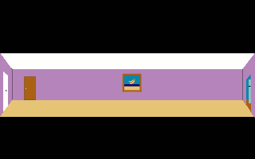
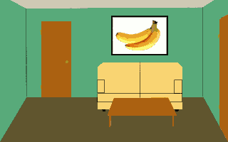
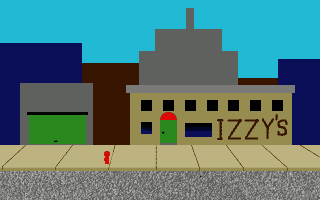
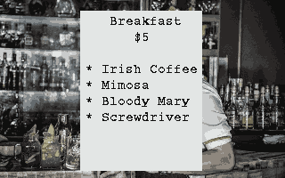
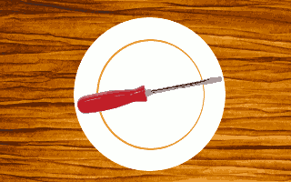
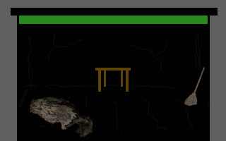
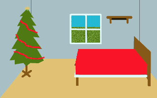

# XCI Appendix: Configuration Walkthrough of the Example Game

The example game that comes with the XCI toolchain, "My Game", is not really a game so much as an exercise in game design for the sake of testing and instruction. A "real" game should be bigger and more complex, with an actual story, characters, action, problem solving, etc. More than minimal effort on creating graphics and sound would also be a good idea!

This guide is a level-by-level walkthrough of the game configuration, showing how XCI is used to build game mechanics and create sound and graphics.

## Contents

* [Top-Level Configuration](#top-level-configuration)
* [Zone 0](#zone-0)
   * [Level 0](#zone-0-level-0)
   * [Level 1](#zone-0-level-1)
* [Zone 1](#zone-1)
   * [Level 0](#zone-1-level-0)
   * [Level 1](#zone-1-level-1)
   * [Level 2](#zone-1-level-2)
* [Zone 2](#zone-2)
   * [Level 0](#zone-2-level-0)
   * [Level 1](#zone-2-level-1)
   * [Level 2](#zone-2-level-2)
   * [Level 3](#zone-2-level-3)
   * [Level 4](#zone-2-level-4)
   * [Level 5](#zone-2-level-5)
   * [Level 6](#zone-2-level-6)
   * [Level 7](#zone-2-level-7)
   * [Level 8](#zone-2-level-8)
   * [Level 9](#zone-2-level-9)


## Top-Level Configuration
The [main documentation](../README.md) goes through all of the top-level configuration files for this game.

* [Main File](../README.md#main-file)
* [Menu File](../README.md#menu-file)
* [Controls File](../README.md#controls-file)
* [About File](../README.md#about-file)
* [Title Screen File](../README.md#title-screen-file)
* [Inventory File](../README.md#inventory-file)

## Zone 0

Zone 0 was covered comprehensively in the [main documentation](../README.md). The [Zone File](../README.md#zone-files) itself is described in detail. In fact, this guide will skip over the remaining zone files as they pretty self-explanatory once you've seen one.

### Zone 0, Level 0

This level is covered in the main [**Level Files**](../README.md#level-files) documentation.

### Zone 0, Level 1

This level is covered in the [**More Level Examples**](../README.md#more-level-examples) sub-section of the main [**Level Files**](../README.md#level-files) documentation.

## Zone 1

Zone 1 is the first zone that is loaded after the start of the game. It has three levels that take place in other parts of the house and right outside the front door. You will see in each of these levels that "zone0.vgm" is used for music because writing music for another zone was not really necessary, but it does illustrate a way to define a zone by having consistent music through it, but each level can have unique music, if you desire.

### Zone 1, Level 0

This level is defined by [**mygame_z1_level0.xci**](mygame_z1_level0.xci). As with the other levels in ths guide, we will be splitting up the configuration into sections that are described immediately afterward.

Let's start from the beginning.

```
# Zone 1, level 0

bitmap mygame_foyer.data
music zone0.vgm
```

This level takes place in the foyer of the house, which is rendered as an absurdly long hallway.



This was done to better scale the level to the avatar sprite, which makes its first appearance since the title screen. For simplicity, a single sprite is used for the avatar, but with a 200-pixel scene height, a 16x16 character can look pretty small. Having a scene matted out like this can help depict a more closed-in space in which an avatar can navigate. Otherwise, you can try using multiple synchronized sprites for the avatar, as shown with the car sprites in later levels.

```
init
if kitchen_to_foyer
sprite_frames 1  0  1H 2H 3H 2H 1H 4H 5H 4H
sprite 1  288 128
clear_state near_door
clear_state kitchen_to_foyer
end_if
if lr_to_foyer
sprite_frames 1  0  1 2 3 2 1 4 5 4
sprite 1  18 128
clear_state lr_to_foyer
set_state near_door
end_if
if front_to_foyer
sprite_frames 1  0  1 2 3 2 1 4 5 4
sprite 1  18 128
clear_state front_to_foyer
set_state near_door
end_if
end_anim
```

The **init** sequence consists entirely of conditional sub-sequences, so there is no animation that is guaranteed to run during this level. Each sub-sequence is based on a state that indicates which level we came from.  The first time we reach this level it is from the kitchen, so ```kitchen_to_foyer``` will be true.  So, the avatar sprite (index 1) is placed by the doorway to the kitchen and facing left. Sprite frames 1-5 are the avatar facing left, so the defined sequence has all of those frames flipped horizontally. The other two sub-sequences start the avatar from the opposite end of the foyer, within reach of both doors. Here you can see that in each case the sprite is set to use the left-facing frames and the ```near_door``` state is set to true so that the player can immediately open either door, but would have to walk across the foyer to get back to the kitchen.

```
first
text 1  There you are.
wait 60
text 1  You are me.
wait 60
text 1  We are we.
wait 60
text 1  Let's go do something.
end_anim
```

The **first** sequence displays some text to explain that, in fact, the player is John Doe and the voice of the narration switches to first person, plural. This is all that is placed in this sequence, as even if the we go back to the kitchen, we don't need to see this text again, but we do need the level to be set up in the same way, so all the sprite and state initialization is kept within the **init** sequnece.

```
tool_trigger use  0 8  1 18
if near_door
sprite_frames 1  0  3H
wait 30
if_not got_screwdriver
go_level 1 1
end_if
if got_screwdriver
set_state from_house
go_level 2 6
end_if
if_not near_door
clear
text 1  We can't reach the door from here.
end_if
end_anim
```

The first trigger is for "using" the front door. If the avatar is near the door, we go to one of the levels that take place in front of the house ([1:1](#zone-1-level-1) or [2:6](##zone-2-level-6)). As we'll see later in the game, we can come back to this level after having driven away and then back to the house. This can only happen if the ```got_screwdriver``` state is true, so that decides which level we go to when going through the front door, as each of those levels has a different placement of the car sprites and different destination levels when driving away. There is also a subsequence in case the avatar is still standing by the kitchen doorway, and the player is informed that they can't reach the door from there.

```
tool_trigger look  0 8  1 18
clear
text 1 That's the front door to the house.
end_anim
```

This trigger is also for the front door, but this time for "looking" at it. Like other "look" triggers, this gives the player some information to help them navigate the game, in this case telling them where the door leads. As it comes after the "use" trigger for the same area, the player will need to explicity select the "look" tool to trigger this sequence.

```
tool_trigger use  3 13  5 16
if near_door
sprite_frames 1  0  11
wait 30
go_level  1 2
end_if
if_not near_door
clear
text 1  We can't reach the door from here.
end_if
end_anim
```

This trigger is for "using" the door to the living room. Like with the front door, the avatar must be near it to open the door and go to the living room level ([1:2](#zone-1-level-2)). Otherwise, the player will again be reminded that they can't reach the door from the kitchen doorway.

```
tool_trigger look  3 13  5 16
clear
text 1 That's the door to the living room.
end_anim
```

This trigger is also for the living room door, but this time for "looking" at it. As it comes after the "use" trigger for the same area, the player will need to explicity select the "look" tool to trigger this sequence.

```
tool_trigger walk  0 8  5 18
if_not near_door
sprite_move  1  4  135  -2 0
wait 255
wait 255
wait 30
set_state near_door
end_if
end_anim
```

This trigger is for "walking" to the left end of the foyer. The trigger area included both the doors, but also has some previously unclaimed space between them, so the "walk" cursor will automatically appear when the mouse is moved there. The whole area can be used for the trigger if the "walk" tool is explicitly selected. First, it checks to make sure the avatar is not already near the door, then kicks off the animation to walk there 2 pixels at a time every 4 jiffys. This takes a while to accomplish all 135 steps, so three **wait** instructions are needed to wait a grand total of 525 jiffys, or 8.75 seconds. Then the ```near_door``` state is set to true so that the player can open one of the doors. If the avatar is already near the door when this trigger occurs, nothing happens, as the whole sequence is taken up with the ```if_not near_door``` sub-sequence.

```
tool_trigger run  0 8  5 18
if_not near_door
sprite_move  1  2  135  -2 0
wait 255
wait 15
set_state near_door
end_if
end_anim
```

This trigger is for "running" to the left end of the foyer, using the same area as the previous trigger. This will make the avatar reach the doors twice as quickly, but will require the player to explicity select the "run" tool as it comes after the "walk" trigger. Again, this trigger will do nothing if the avatar is already near the doors.

```
tool_trigger walk  38 13  39 18
if near_door
sprite_frames 1  0  1 2 3 2 1 4 5 4
sprite_move  1  4  135  2 0
clear_state near_door
wait 255
wait 255
wait 30
go_level 0 1
end_if
if_not near_door
sprite_frames 1  0  3
wait 30
go_level  0 1
end_if
end_anim
```

This trigger is for "walking" through the kitchen doorway. In this case, since there is no door to "use", the player will always end up back in the [kitchen](#zone-0-level-0). It's just a matter of the animation required to do that. If the avatar is near the door, it will need to walk across the screen, a reverse of the previous "walk" trigger. If the avatar is already by the doorway, it will simply face the doorway, then go there a half-second later.

```
tool_trigger run  38 13  39 18
if near_door
sprite_frames 1  0  1 2 3 2 1 4 5 4
sprite_move  1  2  135  2 0
clear_state near_door
wait 255
wait 15
go_level 0 1
end_if
if_not near_door
sprite_frames 1  0  3
wait 30
go_level  0 1
end_if
end_anim
```

This trigger is for "running" through the kitchen doorway, which works the same as the previous trigger, except that it will move twice as quickly, so the wait time is cut in half before moving on to the [kitchen](#zone-0-level-1). This will make the avatar reach the kitchen twice as quickly, but will require the player to explicity select the "run" tool as it comes after the "walk" trigger. If the avatar is already by the doorway, it does the same animation as the "walk" trigger in this state.

```
tool_trigger look  38 13  39 18
clear
text 1  That's the doorway to the kitchen.
end_anim
```

This trigger is for "looking" at the kitchen doorway.  As it comes after the "walk" and "run" triggers for the same area, the player will need to explicity select the "look" tool to trigger this sequence.

```
tool_trigger look  19 12  22 15
clear
text 1  We really love bananas.
end_anim
```

This trigger is for "looking" at the painting of the banana bunch that was seen in the kitchen. Its area doesn't overlap with any previous trigger, making it the first "look" trigger to be a default action. It introduces a theme of the character really loving bananas.

```
tool_trigger talk  19 12  22 15
clear
text 2  "I love you, bananas!"
end_anim
```

This final trigger is for the same area as the previous one, but for the case where the "talk" tool was explicitly selected. Now we see the first time that the character can speak in his own voice, which uses text style 2 (yellow on black) and quotes. We keep this arrangement for the rest of the game, with text style 1 being used for narration only.

### Zone 1, Level 1

This level uses [**mygame_z1_level1.xci**](mygame_z1_level1.xci):

```
# Zone 1, level 1

bitmap mygame_house.data
music zone0.vgm
```

We can see that the house background is being reused for this level after having appeared in [the very first level](#zone-0-level-0). Because of this, we can reuse much of the animation for this level.

```
init
sprite_frames 2  0  30 31 32 33 34 35 36 37 # Flag waving
sprite 2  282 50                            # Top-right of pole
sprite_move 2  6  255  0 0                  # Fixed position, 10 fps, 25.5 s
sprite_frames 3  0  38 39  # Front of car
sprite 3  86 170           # Parked, not moving
sprite_frames 4  0  40     # Rear of car
sprite 4  102 170          # Parked, not moving
sprite_frames 1  0  6
sprite 1  148 170
end_anim
```

Like before, the **init** sequence sets up the waving flag and the car, this time with frames already defined for the front end of the car to drive away. Since the rear of the car is empty in the beginning, only a single frame is defined. that will change once the avatar "enters" the car to drive away and the sprite frames will change to reflect that. What's new in this level is that the avatar is also placed in front of the house, facing front. Again, only a single frame is defined as the only move coming up will require him to turn to the left and never face front again.

Note that there is no **first** sequence as this level has no need for one. We've seen this scenery before and don't need any further exposition.

```
tool_trigger look  18 21  19 22
clear
text 1 There we are.
end_anim
```

The first trigger is for "looking" at the avatar. We know that this level is only interactive when the avatar is located precisely within this rectangle, so we can use it as an unconditional trigger area.

```
tool_trigger talk  18 21  19 22
clear
text 2 "Lookin' good!"
end_anim
```

This trigger is for the same area containing the avatar, but requires the "talk" tool to be explicitly selected because it comes after the "look" trigger.  Again, we use text style 2 for the playable character to talk, in this case to himself.

```
item_trigger banana 1 1  18 21  19 22
clear
if first_banana
text 1 We're not hungry anymore.
wait 60
text 2 Not even for bananas.
get_item banana 1 # replenish lost banana
end_if
if_not first_banana
text 1 We could use a snack for the road.
wait 60
text 2 Mmm... banana!
set_state first_banana
end_if
end_anim
```

This trigger is also for the avatar area, but this time with a banana from the inventory. This is the first **item_trigger** we see with a non-zero cost argument. This means that the banana quantity will be debited by 1 as a result of this trigger. However, as we see in the first sub-sequence, if ```first_banana``` is already set, we tell the player that the character isn't hungry anymore and re-credit the banana that was debited with a **get_item**. This way, the player never notices that they were ever short a banana. However, if this is the first time it was triggered, ```first_banana``` will not have been defined and therefore initialized to false and the second sub-sequence is executed. Now we indicate in the text that the banana is being eaten and the inventory debit goes through along with ```first_banana``` being set to true. After this first trigger, the player will be able to see that the quantity of bananas has gone down to 2, but it will never go any lower because of the first sub-sequence.

```
item_trigger coffee 1 0  18 21  19 22
clear
text 1 We're still pretty awake.
wait 60
text 1 Let's save the coffee for later.
end_anim
```

This trigger attempts to do the same with the coffee, but has a zero cost and lets the player know that they don't need coffee now.

```
item_trigger phone 1 0  18 21  19 22
clear
text 1 Don't need to call for a ride.
wait 60
text 1 Our car is right here.
end_anim
```

This final trigger for the avatar is with the phone item, which the player has had since the start of the game. The phone is not consumable, so it has a zero cost. This makes it effectively a use trigger on an inventory item. But in this case, we say that there's no need to use the phone at this time. Perhaps in a different version of the game the player could use the phone to call for a ride or do some other task.

```
tool_trigger look  10 21  15 24
clear
text 1 That's our car.
wait 60
text 1 We should have our keys.
end_anim
```

The default trigger for the car is with the "look" tool. This provides a hint that to use the car, the player needs to use the keys from the inventory.

```
tool_trigger use  10 21  15 24
clear
text 1 Not much you can do with a car
text 1 without keys.
end_anim
```

This trigger is for the case where the player explicitly tries to apply the "use" tool on the car, which is not how we want the game to proceed. Here's another, stronger hint that the player should use the keys.

```
tool_trigger talk  10 21  15 24
clear
text 2 "Hello, car."
wait 60
text 3 "Hello, Michael."
wait 60
text 2 "Um... My name is John."
wait 60
text 3 "Sorry. Wrong game."
end_anim
```

The last **tool_trigger** for the car is for "talking" to the car. This is just a little Easter Egg, as it is not what a player would be expected to do unless they were really exploring the level. So, we reward that curiosity with our first dialog between the playable character and a non-playable character (NPC). As before, we show the playable character using text style 2 for their own dialog. The NPC (in this case, the car) uses text style 3 (blue on black) for its dialog, as will all future NPCs.

```
item_trigger keys 1 0  10 21  15 24
sprite_frames 1  0  1H 2H 3H 2H 1H 4H 5H 4H
sprite_move 1  4  26  -2 0
wait 104
sprite_hide 1
sprite_frames 4  0  41 42
sprite_move 3  2  42  -2 0
sprite_move 4  2  42  -2 0
wait 84
go_level 2 0
end_anim
```

Finally, we have the trigger that lets us move forward in the game, by applying the keys to the car. We start the animation by turning the avatar to the left and walking him toward the car using a new frame loop. We don't use the "walk" or "run" tools here as this is a more specialized animation and the avatar is already sufficiently close to the car that it makes visual sense just to apply the keys at this point. Once the avatar is finished walking toward the car, the avatar is immediately hidden and the sprite for the rear of the car gets a new frame sequence showing the avatar's head inside the window. Then we start a pair of sprite movements that will keep both halves of the car moving together until they get to the far left of the screen. At that point, we go to [level 0 of zone 2](#zone-2-level-0).

```
tool_trigger use  19 16  22 21
sprite_frames 1  0  11
wait 30
set_state front_to_foyer
go_level 1 0
end_anim
```

The last trigger is for the front door so that we can go back to the [foyer](#zone-1-level-0). First the avatar sprite is given a new frame to turn towards the house.  Then a half-second later we set the ```front_to_foyer``` state to true so that the avatar will be by the door when that level is loaded.

### Zone 1, Level 2

This level uses [**mygame_z1_level2.xci**](mygame_z1_level2.xci):

```
# Zone 1, level 2

bitmap mygame_livingroom.data
music zone0.vgm
```

This level takes place in the living room, which introduces a new background bitmap.



This is another scene, like the [kitchen](#zone-0-level-1), where the perspective switches to first-person. We don't need to keep things on the scale of the avatar, which makes it easier to accurately render items that can be added to the inventory. One could make a game that is all first-person and have more sprite frames freed up for in-scene animation.

```
init
sprite_frames 2  0  47 48
if_not laptop_taken
tiles  0  22 17  176 177 176H
tiles  0  22 18  178 179 178H
if_not usb_taken
tiles  0  26 19  183
end_if
if usb_inserted
tiles  0  22 19  180 181 182
sprite 2  180 139
sprite_move 2  15  255  0 0
end_if
if_not usb_inserted
tiles  0  22 19  180 181 180H
end_if
end_if
end_anim
```

The **init** sequence sets up tiles for any items that have not yet been taken from the scene and added to the inventory. We use state variables for that. Unconditionally, we set the sprite frame sequence for the laptop screen, which is simply a blinking cursor. The rest of the sequence is a sub-sequence that is executed if the laptop has not been taken, so it needs to be rendered on the coffee table, starting with a two-row tilemap for the upper two-thirds. Then within that sub-sequence are three sub-sequences based what has been done with the USB drive.  If it wasn't taken, it is rendered on the table as a single tile. The next sub-sequence checks if it has been inserted into the laptop. If it has, the bottom third of the laptop is rendered with the USB drive sticking out and then the screen sprite is placed to show the prompt blinking.  If the USB drive hasn't been inserted, the last sub-sequence is executed, rendering the bottom without anything inserted.

```
first
text 1 Welcome to our living room.
end_anim
```

The **first** sequence simply tells the player where we are. No need to say that again in future visits.

```
tool_trigger use  38 3  39 25
set_state lr_to_foyer
go_level 1 0
end_anim
```

The first trigger is for "using" the door back to the [foyer](#zone-1-level-0). This unconditionally returns to that level after setting the ```lr_to_foyer``` state so that the avatar will be by the door.

```
tool_trigger look  38 3  39 25
clear
text 1 That's the door back to the foyer.
end_anim
```

This trigger is for "looking" at the door to the foyer, which requires the player to explicity select the "look" tool, coming after the "use" trigger for the same area. It simply tells the player what the door is.

```
tool_trigger look  7 4  11 17
clear
text 1 That's our bedroom.
wait 60
text 1 Nobody goes in there.
end_anim
```

This trigger is for "looking" at the bedroom door, which is the default action since it can't be opened in this level.

```
tool_trigger use  7 4  11 17
clear
text 1 We can't go in the bedroom now.
wait 60
text 1 Any kind of business in there
text 1 would be a holy grail moment.
end_anim
```

This trigger is for when the player tries to explicity "use" the bedroom door, which also provides a clue as to what that would require.

```
tool_trigger look  20 4  29 10
clear
text 2 Yeah, we really like bananas.
end_anim
```

This trigger is for "looking" at the big banana picture.

```
tool_trigger use 22 17  24 19
if_not laptop_taken
if usb_inserted
clear
text 1 Ok, we'll take the laptop with us.
wait 30
sprite_hide 2
tiles  0  22 17  0 0 0
tiles  0  22 18  0 0 0
tiles  0  22 19  0 0 0
get_item laptop 1
get_item thumbdrive 1
set_state laptop_taken
end_if
if_not usb_inserted
clear
text 1 It's not working. It needs to
text 1 boot from a thumbdrive.
end_if
end_if
end_anim
```

This trigger is for "using" the laptop, which is the default action.  The sequence is entirely taken up by a sub-sequence that will only execute if the laptop hasn't yet been taken into the inventory. Within that are two sub-sequences that test for the USB drive being inserted. The first executes if the drive is inserted, in which case the screen sprite and all the laptop tiles are removed from the display, then the laptop and attached USB drive are both added to the inventory.  The second sub-sequence executes if the USB drive has not been inserted, in which case the player is given a clue about ahat needs to be done to use the laptop.

```
tool_trigger look 22 17  24 19
if_not laptop_taken
if usb_inserted
text 1 Oh yeah, that's the stuff.
end_if
if_not usb_inserted
text 1 That's our trusty laptop.
wait 60
text 1 Works great except that
text 1 it won't boot on its own.
end_if
end_if
end_anim
```

This trigger is for "looking" at the laptop, which requires the player to explicity select the "use" tool. The entire sequence is taken up with a sub-sequence that will only execute if the laptop has not yet been taken, just like the "use" trigger. If the USB drive has been inserted, you get a nice comment about the awesome screen prompt. Otherwise, you get another clue about how to use the laptop.

```
item_trigger thumbdrive  1 1  22 17  24 19
if_not laptop_taken
tiles 0  24 19  182
clear
text 1 Ok, now we can boot the laptop
wait 60
sprite 2  180 139
sprite_move 2  15  255  0 0
set_state usb_inserted
end_if
end_anim
```

This trigger is for applying the USB drive to the laptop. WE only want this to work if the laptop is still on the table, so the entire sequence is taken up with a sub-sequence that will only execute if the laptop has not been taken. It first replaces a tile of the laptop with one that shows the drive sticking out, then starts the screen prompt animation and finally setting ```usb_inserted``` to true so that the laptop can be added to the inventory when it is next "used".

```
tool_trigger use  26 19  26 19
if_not usb_taken
clear
text 1 This thumbdrive should come in handy.
get_item thumbdrive 1
tiles  0  26 19  0
set_state usb_taken
end_if
end_anim
```

This trigger is for "using" the USB drive while it is still on the table. If it hasn't been taken yet, it is added to the inventory and then the tile is removed. The ```usb_taken``` state is set to true so that this trigger sequence won't execute again.

```
tool_trigger look  26 19  26 19
if_not usb_taken
clear
text 1 It's a USB thumbdrive.
wait 60
text 1 Might be a bootable image.
end_if
end_anim
```

This trigger is for "looking" at the USB drive while it is still on the table, which requires the player to explicity select the "look" tool because the previous "use" trigger is for the same area.  If the drive hasn't been taken yet, the player gets a description and a clue as to what it could be used for.

## Zone 2

This is the final zone of the game. It has a full 10 levels, the maximum for any XCI game zone. This results in a noticeable delay when loading the zone compared to the others since over 300kB of files are loaded into banked RAM for the transition. This should be instructive, to make sure that when you are loading a big zone, the transition should be able to handle the delay organically. In the case of this game, it is happening during a car ride, which is a good, cinematic reason to "fade to black" for a few seconds.

Again, most of the levels still use the "zone0.vgm" music, until the surprise ending.

### Zone 2, Level 0

This level uses [**mygame_z2_level0.xci**](mygame_z2_level0.xci):

```
# Zone 2, level 0

bitmap mygame_bar_ext.data
music zone0.vgm
```

This level introduces a new background: the exterior of Izzy's Bar.



```
init
sprite_frames 2  0  49 50  # beacon
sprite 2  182 8
sprite_move 2  60  255  0 0
sprite_frames 5  0  51 52  # beer sign
sprite 5  191 134
sprite_move 5  45  255  0 0
end_anim
```

The **init** sequence starts two sprite animations. First is a flashing red beacon at the top of a skyscraper in the background. It changes between on and off every second.  The other sprite is a neon "BEER" sign in the window of Izzy's that also flashes on and off, but every 0.75 seconds so that it is out-of-phase with the beacon. Both animations will continue for the maximum amount of frames.

```
first
sprite_frames 3  0  38 39  # Front of car
sprite_frames 4  0  41 42  # Rear of car, driving
sprite 3  320 170
sprite 4  336 170
sprite_move 3  2  42  -2 0
sprite_move 4  2  42  -2 0
wait 60
text 1 This is Izquierdito's.
wait 30
sprite_frames 4  0  40     # Rear of car, parked
sprite_frames 1  0  1H 2H 3H 2H 1H 4H 5H 4H
sprite 1 244 170
wait 30
text 1 Or Izzy's, for short.
sprite_move 1  4  12  -2 0
wait 48
sprite_frames 1  0  9 10 11 10 9 10H 11H 10H
sprite_move 1  4  12  0 -2
wait 48
sprite_frames 1  0  1H 2H 3H 2H 1H 4H 5H 4H
text 1 Let's go in for a drink.
end_anim
```

The **first** sequence contains an animation of the car pulling up to Izzy's and the avatare getting out and walking up onto the sidewalk, all the while providing exposition in the text area. This is done by reusing the frame sequences for the car sprites from [the previous level](#zone-1-level-1) and placing the car sprites just off screen then moving them to the left. After 1.5 seconds, the car sprites have just stopped moving 6 jiffys ago and the rear sprite is replaced with the empty frame and the avatar sprite is placed in front of the car. After half a second, the avatar moves to the left using the frame sequence we've seen before. After taking 12 steps over 48 jiffys, the avatar turns toward the building and starts moving up using a new frame sequence for upward movement, facing "away from the camera". Then, after another 48 jiffys the frame sequence is reverted to the previous one and the avatar is ready to start moving to the left again in response to the next "walk" or "run" trigger.

```
tool_trigger use  20 16  21 18
if near_izzys
sprite_frames 1  0  9
wait 30
go_level 2 1
end_if
if_not near_izzys
clear
text 1 We're not close enough to the door.
end_if
end_anim
```

The first trigger is for "using" the door to Izzy's. Like the doors in the [foyer](#zone-1-level-0), the avatar needs to be near it to open. If the avatar is near the door, its frame changes to face the door and then a half second later we go "inside" to [level 1](#zone-2-level-1).

```
tool_trigger walk  20 19  21 21
if_not near_izzys
if_not near_garage
sprite_move 1  4  28  -2 0
wait 112
set_state near_izzys
end_if
if near_garage
sprite_frames 1  0  1 2 3 2 1 4 5 4
sprite_move 1  4  54  2 0
clear_state near_garage
wait 216
set_state near_izzys
end_if
end_if
end_anim
```

This trigger is for "walking" to the part of the sidewalk in front of Izzy's door. The entire sequence is taken up by a sub-sequence that will only execute if the avatar is not already in front of Izzy's. This level has three different locations that the avatar can be, starting with near the car. After that, the avatar can move up and down the sidewalk between the areas in front of Izzy's and the garage to the left. If avatar is not near Izzy's or the garage, then it must still be in the initial position after exiting the car, so the avatar moves to the left until it reaches the destination. Otherwise, if the avatar is in front of the garage, it will move to the right. This is the only scenario in which the avatar moves to the right, so the frame sequence only changes to that here. In each case, the ```near_izzys``` state is set to true, which is mutually exclusive to the ```near_garage``` state, which will be false after this sequence.

```
tool_trigger run  20 19  21 21
if_not near_izzys
if_not near_garage
sprite_move 1  2  28  -2 0
wait 56
set_state near_izzys
end_if
if near_garage
sprite_frames 1  0  1 2 3 2 1 4 5 4
sprite_move 1  2  54  2 0
clear_state near_garage
wait 108
set_state near_izzys
end_if
end_if
end_anim
```

This sequence is for "running" to Izzy's door. It works exactly the same as the previous "walk" trigger, but requires the player to explicity select the "run" tool and then executes twice as quickly.

```
tool_trigger use 4 15  10 18
if near_garage
clear
text 1 The door appears to be jammed.
wait 60
text 1 It only opens a tiny bit.
wait 30
text 1 If only we had something
text 1 to pry it open...
end_if
if_not near_garage
clear
text 1 We're not close enough to the door.
end_if
end_anim
```

This trigger is for "using" the garage door.  If the avatar is near the garage, the player gets a clue about how to open it.  Otherwise, it tells the player that the avatar isn't close enough.

```
tool_trigger look 4 15  10 18
clear
text 1 That old garage looks abandoned.
wait 60
text 1 The door doesn't even have a lock.
end_anim
```

This trigger is for "looking" at the garage door, which requires the player to explicity select the "look" tool because the previous "use" trigger is for the same area. It clues the player into the fact that it might be able to be opened.

```
tool_trigger walk  4 19  10 21
if_not near_garage
if_not near_izzys
sprite_move 1  4  82  -2 0
wait 255
wait 73
set_state near_garage
end_if
if near_izzys
sprite_frames 1  0  1H 2H 3H 2H 1H 4H 5H 4H
sprite_move 1  4  54  -2 0
clear_state near_izzys
wait 216
set_state near_garage
end_if
end_if
end_anim
```

This trigger is for "walking" to the sidewalk area in front of the garage door. The sequence is completely taken up with a sub-sequence that only executes if the avatar is not already in front of the garage. If the avatar is not in front of Izzy's, it must be just outside of the car, so the it will need to move 164 pixels to the left. If it is in front of Izzy's, it only has to move 108 pixels, but the frame sequence needs to re-established as the avatar might be turned to the right. In all cases, the ```near_garage``` state will be true and ```near_izzys``` will be false by the end of the sequence.

```
tool_trigger run  4 19  10 21
if_not near_garage
if_not near_izzys
sprite_move 1  2  82  -2 0
wait 164
set_state near_garage
end_if
if near_izzys
sprite_frames 1  0  1H 2H 3H 2H 1H 4H 5H 4H
sprite_move 1  2  54  -2 0
clear_state near_izzys
wait 108
set_state near_garage
end_if
end_if
end_anim
```

This trigger is for "running" to the garage door, so it works the same as the previous "walk" trigger except that it requires the player to explicity select the "run" tool and the resulting animation takes half the time.

### Zone 2, Level 1

This level uses [**mygame_z2_level1.xci**](mygame_z2_level1.xci):

```
# Zone 2, level 1

bitmap izzy.data
music zone0.vgm
```

This level introduces the only human NPC in the game, Izzy. This level is for general interaction with him and it is visited three times within a 5-level sequence. So, the background is just a free stock photo of a bartender and the only animation is in the text field.


```
init
if from_menu
wait 30
text 3 "That'll be five bucks."
clear_state from_menu
end_if
if got_screwdriver
wait 30
text 3 "Enjoy your screwdriver."
wait 60
text 2 "Thanks. I'll take it to go."
wait 60
text 3 "OK. Adios, amigo!"
wait 90
go_level 2 4
end_if
end_anim
```

The **init** sequence starts the last two of the three visits to this level. The second visit happens after we [view the menu](#zone-2-level-2), and Izzy asks for $5.  The third visit happens after we [take the screwdriver](#zone-2-level-3) and Izzy bids us farewell and we go [back outside](#zone-2-level-4). During the first visit, neither ```from_menu``` nor ```got_screwdriver``` is set, so no animation is executed.

```
first
text 3 "Hey, welcome back, John!"
wait 60
text 2 "Hi, Izzy."
wait 90
text 3 "Whatcha having?"
wait 60
text 2 "I don't know. It's kinda early."
wait 90
text 3 "No problem! We got a breakfast menu."
wait 120
go_level 2 2
end_anim
```

The **first** sequence introduces Izzy, as nothing happened in the **init** sequence during the first visit. Again, the NPC dialog uses text style 3 and the playable character's dialog uses text style 2. After the dialog, there is a 2-second delay before automatically proceeding to [the next level and see the menu](#zone-2-level-2).

```
item_trigger money 5 5  0 1  39 25
clear
wait 30
text 3 "Thanks! Just a sec..."
wait 60
text 3 "OK, here you go!"
wait 90
go_level 2 3
end_anim
```

This trigger is only possible during the second visit when there is no automatic level transition. The player must have $5 in their inventory, then click anywhere on the level background to pay for the screwdriver. After a few words from Izzy, we proceed to the [the next level and see our order](#zone-2-level-3).

```
tool_trigger talk  13 2  33 25
clear
text 2 "How much again?"
wait 60
text 3 "Five bucks. Got it?"
end_anim
```

This trigger is for "talking" to Izzy during the second visit. It is the only default action as an **item_trigger** always requires the player to explicity select the item from the inventory, even if it comes first. Unlike the previous trigger, the area for this one is only for the rectangle containing Izzy's figure and not the whole background. This trigger mainly exists so that there is some sort of default action in case the player somehow missed that they were supposed to pay for their order.

### Zone 2, Level 2

This level uses [**mygame_z2_level2.xci**](mygame_z2_level2.xci):

```
# Zone 2, level 2

bitmap breakfast.data
music zone0.vgm
```

This level uses a background that modifies [the previous level](#zone-2-level-1) to have a menu superimposed over the center. This could have been done with tiles, but this ended up being a simpler approach that made it easier to use existing graphics tools to create while also saving VRAM from having to persistently store single-use tiles.



Each item on the menu provides an area for easy triggering, as we will see.

```
init
wait 30
text 3 "So, whatcha thinking?"
end_anim
```

The **init** sequence simply has Izzy ask us what we're having, prompting the player to select something from the menu.

```
tool_trigger use  12 10  27 11
clear
text 3 "Sorry, out of whiskey."
end_anim
```

This trigger is for "using" the Irish Coffee selection on the menu. Izzy tells us we can't have it.

```
tool_trigger use  12 12  27 13
clear
text 3 "Sorry, out of champagne."
end_anim
```

This trigger is for "using" the Mimosa selection on the menu. Izzy tells us we can't have it.

```
tool_trigger use  12 14  27 15
clear
text 3 "Sorry, out of tomato juice."
end_anim
```

This trigger is for "using" the Bloody Mary selection on the menu. Izzy tells us we can't have it.

```
tool_trigger use  12 16  27 17
clear
text 3 "One screwdriver, coming up!"
wait 90
set_state from_menu
go_level 2 1
end_anim
```

This trigger is for "using" the Screwdriver selection on the menu. Izzy finally lets us have something, and we return to [the previous level](#zone-2-level-1) after setting the ```from_menu``` state to true, indicating that it will be our second visit.

### Zone 2, Level 3

This level uses [**mygame_z2_level3.xci**](mygame_z2_level3.xci):

```
# Zone 2, level 3

bitmap screwdriver.data
music zone0.vgm
```

This level introduces an entirely new background: a plate with a screwdriver on it.



The entire purpose of this level is to give the player an opportunity to add a screwdriver to their inventory, so we have a nice big target for a use trigger.

```
init
wait 30
text 3 "My last one. You were lucky!"
end_anim
```

The init sequence simply has some words from Izzy, and then all that's left to do is wait for the one and only trigger.

```
tool_trigger use  10 11  30 16
wait 30
text 1 Hmm... it might come in handy.
wait 90
get_item screwdriver 1
set_state got_screwdriver
go_level 2 1
end_anim
```

The trigger "uses" the screwdriver, resulting in it being added to the inventory and returning to [the previous level](#zone-2-level-1) for the third and final visit. Note that the narration at the beginning is not preceded by a **clear** key, so it will be placed under the line from Izzy in the text area, and then 1.5 seconds later the level transition happens.

### Zone 2, Level 4

This level uses [**mygame_z2_level4.xci**](mygame_z2_level4.xci):

```
# Zone 2, level 4

bitmap mygame_bar_ext.data
music zone0.vgm
```

This level returns us to the exterior of Izzy's, but it has a different set of triggers from [the last level at this scene](#zone-2-level-0). It also allows for freer movement, so this level may be revisited after driving back home.

```
init
sprite_frames 3  0  38 39  # Front of car
sprite_frames 2  0  49 50  # beacon
sprite 2  182 8
sprite_move 2  60  255  0 0
sprite_frames 5  0  51 52  # beer sign
sprite 5  191 134
sprite_move 5  45  255  0 0
if near_garage
sprite_frames 1  0  1 2 3 2 1 4 5 4
sprite 1  56 146
sprite_frames 4  0  40     # Rear of car, parked
sprite 3  236 170
sprite 4  252 170
end_if
if_not near_garage
if_not near_izzys
sprite_frames 4  0  41 42  # Rear of car, driving
sprite 3  320 170
sprite 4  336 170
sprite_move 3  2  42  -2 0
sprite_move 4  2  42  -2 0
wait 90
sprite_frames 4  0  40     # Rear of car, parked
sprite_frames 1  0  1H 2H 3H 2H 1H 4H 5H 4H
sprite 1 244 170
wait 30
sprite_move 1  4  12  -2 0
wait 48
sprite_frames 1  0  9 10 11 10 9 10H 11H 10H
sprite_move 1  4  12  0 -2
wait 48
sprite_frames 1  0  1H 2H 3H 2H 1H 4H 5H 4H
set_state near_car
end_if
end_if
end_anim
```

The init starts the same way as [Level 0](#zone-2-level-0), with the beacon and the beer sign flashing. Then there are sub-sequences that are run based on how this level was entered. If it was from Izzy's, then this must be the first visit, so that is handled in the **first** sequence. Subsequently, this scene could be re-visited from either the garage interior (in which case ```near_garage``` would still be true) or from the house (in which case both ```near_garage``` and ```near_izzys``` would be false). If we're coming from the garage, the avatar sprite i splaced on the sidewalk in front of the garage, facing left, and the car sprites are placed where is was parked last time. For simplicity, the car is parked at the same location on re-visits to this level as it was when we virst visited Izzy's. If we are coming from home, the earlier animation of driving up and walking onto the sidewalk is repeated with the addition of setting the new ```near_car``` state to true.

```
first
sprite_frames 1  0  6
sprite 1  164 146
sprite_frames 4  0  40     # Rear of car, parked
sprite 3  236 170
sprite 4  252 170
end_anim
```

In the **first** sequence, the avatar is placed in front of Izzy's door (```near_izzys``` will already be set to true) and the car is parked where we left it. This is the only point in this level where the avatar can be in front of Izzy's door as there are no triggers here to return to that spot or state.

```
tool_trigger use 4 15  10 18
if near_garage
clear
text 1 The door appears to be jammed.
wait 60
text 1 It only opens a tiny bit.
wait 60
text 1 If only we had something
text 1 to pry it open...
end_if
if_not near_garage
clear
text 1 We're not close enough to the door.
end_if
end_anim
```

The first trigger is to "use" the garage door. The resulting sequence is identical to the same **tool_trigger** from [Level 0](#zone-2-level-0).

```
tool_trigger look 4 15  10 18
clear
text 1 That old garage looks abandoned.
wait 60
text 1 The door doesn't even have a lock.
end_anim
```

This trigger is another repeat, where we are "looking" at the garage door after explicity selecting the "look" tool. The same sequence from [Level 0](#zone-2-level-0) is executed.

```
item_trigger screwdriver 1 0  4 15  10 18
clear
text 1 That should do the trick...
wait 60
text 1 It's opening!
wait 90
go_level 2 5
end_anim
```

This trigger is new, as now we have a screwdriver in our inventory to pry the garage door open. After the screwdriver is applied to the door, there is some narration and 1.5 seconds later we go [inside the garage](#zone-2-level-5).

```
tool_trigger walk  4 19  10 21
if_not near_garage
if_not near_izzys
sprite_frames 1  0  1H 2H 3H 2H 1H 4H 5H 4H
sprite_move 1  4  82  -2 0
wait 255
wait 73
set_state near_garage
end_if
if near_izzys
sprite_frames 1  0  1H 2H 3H 2H 1H 4H 5H 4H
sprite_move 1  4  54  -2 0
clear_state near_izzys
wait 216
set_state near_garage
end_if
end_if
end_anim
```

This trigger is another repeat from [Level 0](#zone-2-level-0) for "walking" to the garage door, which again is the default action for the sidewalk area in front of it. The resulting sequence is identical, allowing the avatar to walk from either Izzy's door or the car.

```
tool_trigger run  4 19  10 21
if_not near_garage
if_not near_izzys
sprite_frames 1  0  1H 2H 3H 2H 1H 4H 5H 4H
sprite_move 1  2  82  -2 0
wait 164
set_state near_garage
end_if
if near_izzys
sprite_frames 1  0  1H 2H 3H 2H 1H 4H 5H 4H
sprite_move 1  2  54  -2 0
clear_state near_izzys
wait 108
set_state near_garage
end_if
end_if
end_anim
```

This trigger is also a repeat from [Level 0](#zone-2-level-0) for "running" to the garage door, whcih requires the player to explicity select the "run" tool and then get there in half the time using the same exact sequence as before.

```
tool_trigger walk  27 18  34 24
if near_garage
sprite_frames 1  0  1 2 3 2 1 4 5 4
sprite_move 1  4  82  2 0
clear_state near_garage
wait 255
wait 73
set_state near_car
end_if
if near_izzys
sprite_frames 1  0  1 2 3 2 1 4 5 4
sprite_move 1  4  28  2 0
clear_state near_izzys
wait 112
set_state near_car
end_if
end_anim
```

This is a new trigger to allow the avatar to "walk" back to the car from either Izzy's door or the garage. It's the reverse of the "walk" triggers from [Level 0](#zone-2-level-0), where the avatar could only walk away from the car. At the end of this sequence, the ```near_car``` state will be set to true and both ```near_izzys``` and ```near_garage``` are set to false.

```
tool_trigger run  27 18  34 24
if near_garage
sprite_frames 1  0  1 2 3 2 1 4 5 4
sprite_move 1  2  82  2 0
clear_state near_garage
wait 164
set_state near_car
end_if
if near_izzys
sprite_frames 1  0  1 2 3 2 1 4 5 4
sprite_move 1  2  28  2 0
clear_state near_izzys
wait 56
set_state near_car
end_if
end_anim
```

This trigger is for "running" to the car, which requires the player to explicity select the "run" tool. It dexecutes the same sequence as the default "walk" trigger, but in half the time.

```
tool_trigger look 29 21  34 24
clear
text 1 Hey, our car didn't get stolen!
end_anim
```

This trigger is for "looking" at the car, using an area that fits inside the preceding two triggers, so it requires the player to explicity select the "look" tool and apply it directly to the car. Its rectangle does not include the sidewalk and street area around the car that the previous triggers cover. All it does is comment on the fact that the car is still there.

```
item_trigger keys 1 0  29 21  34 24
if near_car
sprite_frames 1  0  6 7 8 7 6 7H 8H 7H 6
sprite_move 1  4  12  0 2
wait 48
sprite_frames 1  0  1 2 3 2 1 4 5 4
sprite_move 1  4  12  2 0
wait 48
sprite_hide 1
sprite_frames 4  0  41 42
sprite_move 3  2  118  -2 0
sprite_move 4  2  118  -2 0
wait 236
go_level 2 6
end_if
if_not near_car
clear
text 1 We aren't close enough to the car.
end_if
end_anim
```

The last trigger is for applying the keys from the inventory on the car, using the same constrained rectangle as the preceding "look" trigger. If the avatar is already near the car, it triggers a new animation sequence for turning the avatar "toward the camera" and walking down to the street, turning right and then walking toward the car. Once in front of the car, the avatar is hidden and the car's rear sprite is again given the sequence for driving with the avatar's head visible through the window. The car then drives off to the left, presumably going around the block and back to [the house](#zone-2-level-6).  If the avatar is not near the car, there is only some narration telling the player.

### Zone 2, Level 5

This level uses [**mygame_z2_level5.xci**](mygame_z2_level5.xci):

```
# Zone 2, level 5

bitmap garage.data
music zone0.vgm
```

This level introduces a new background: the interior of the garage.



It has a table for holding the grail during the first visit, and other detritus of long-ago adventures on the floor around it.

```
init
if got_grail
wait 30
text 1 We already have the grail.
wait 60
text 1 Let's go home.
wait 60
go_level 2 4
end_if
end_anim
```

The **init** sequence only checks to see if we are re-visiting the level. If ```got_grail``` is true, we know that we've been here before, so we are automatically sent back to [the street](#zone-2-level-4) after some narration with another clue of what to do next.

```
first
sprite_frames 2  0  53
sprite  2 152 88
wait 30
text 1 Behold, the grail!
end_anim
```

The **first** sequence places the grail sprite on the table and then gives a little narration directing the player's attention to the grail.

```
tool_trigger use  19 11  20 12
sprite_hide 2
get_item grail 1
set_state got_grail
text 1 At last, we have the grail!
wait 60
text 1 It's just what we need at home!
wait 90
go_level 2 4
end_anim
```

The first trigger is for "using" the grail. It hides the grail sprite then adds the grail to the inventory. It then give a little narration with a clue about where we should take the grail, then takes us back to [the street](#zone-2-level-4). After this sequence, the ```got_grail``` state is set to true so that if we re-open the garage, the grail won't be there anymore.

```
tool_trigger look  19 11  20 12
clear
text 1 It's the holy grail!
wait 60
text 1 We need one of those.
end_anim
```

This trigger is for "looking" at the grail, which requires the player to explicity select the "look" tool. It provides some more explicit narration of what the player is seeing and needs to do.

```
tool_trigger look  5 18  16 25
clear
text 1 It's an old, stuffed owl.
wait 60
text 1 Nobody wants that dusty old thing.
end_anim
```

This trigger is for "looking" at the owl on the floor, which is the default action for that area. We just get a little narration letting you know that's not why we're in here.

```
tool_trigger look  32 12  36 20
clear
text 1 Whoever owned this mop
wait 30
text 1 never did much cleaning.
end_anim
```

This trigger is for "looking" at the mop on the floor, which is the default action for that area. We just get a little narration letting you know that's not why we're in here.

### Zone 2, Level 6

This level uses [**mygame_z2_level6.xci**](mygame_z2_level6.xci):

```
# Zone 2, level 6

bitmap mygame_house.data
music zone0.vgm
```

This level returns to the front of the house for its third and final appearance in the game. This time, the car is coming from the left, so it must either drive into the scene (if coming from Izzy's) or be parked facing right (if coming from the house). This recycles some of the animation from [the last level at this scene](#zone-1-level-1) but has a reduced trigger set and different destinations based on state.

```
init
sprite_frames 2  0  30 31 32 33 34 35 36 37 # Flag waving
sprite 2  282 50                            # Top-right of pole
sprite_move 2  6  255  0 0                  # Fixed position, 10 fps, 25.5 s
sprite_frames 3  0  38H 39H   # Front of car
if_not from_house
sprite_frames 4  0  41H 42H
sprite 3  16 170
sprite 4  0 170
sprite_move 3  2  42  2 0
sprite_move 4  2  42  2 0
wait 84
sprite_frames 4  0  40H
sprite_frames 1  0  1 2 3 2 1 4 5 4
sprite 1  96 170
sprite_move 1  4  26  2 0
wait 104
sprite_frames 1  0  11
end_if
if from_house
sprite 3  102 170
sprite_frames 4  0  40H
sprite 4  86 170
sprite_frames 1  0  6
sprite 1  148 170
clear_state from_house
end_if
end_anim
```

The **init** sequence again starts with the waving flag animation and setting up the frames for the front sprite of the car, this time horizontally flipped to face right. Then there are a pair of opposing sub-sequences that will be executed based on the ```from_house``` state. If ```from_house``` is false, we are driving back from Izzy's, so there is a new animation for driving from the left end of the road up to the house. When the car parks, the avatar appears in front of the car facing right, then immediately starts walking towards the door. Once directly in front of the door, the avatar turns toward the house and "away from the camera", and there it awaits the first trigger. If ```from_house``` is true, then we must have gone back into the house without the grail and come out again. This gives the player an opportunity to drive back to Izzy's and get the grail. In this case, the car is immediately placed in its facing-right parked position and the avatar is placed in front of the house "facing the camera".

```
tool_trigger use  19 16  22 21
sprite_frames 1  0  11
wait 30
set_state front_to_foyer
if got_grail
go_level 2 7
end_if
if_not got_grail
go_level 1 0
end_if
end_anim
```

The first trigger is for "using" the front door. This causes the avatar to turn toward the house and "away from the camera". Then the ```front_to_foyer``` state is set to true again so that once in the foyer, the avatar will be placed by the front door. The ```got_grail``` state determines which foyer lever this action will take us to. If we got the grail, the state is true and we proceed to [the next level](#zone-2-level-7). If we didn't get the grail, we go back to the [Zone 1 foyer](#zone-1-level-0), which will let us leave the house again and go back for the grail.

```
item_trigger keys 1 0  10 21  15 24
sprite_frames 1  0  1H 2H 3H 2H 1H 4H 5H 4H
sprite_move 1  4  26  -2 0
wait 104
sprite_hide 1
sprite_frames 4  0  41H 42H
sprite_move 3  2  118  2 0
sprite_move 4  2  118  2 0
wait 84
go_level 2 4
end_anim
```

The other trigger is another **item_trigger** to apply the keys to the car and drive away. This time, there is a new animation as the car is now facing right. The avatar gets into the car much as before, but now drives off to the right. Once the car reaches the end of the screen, we go back to [Izzy's](#zone-2-level-4).

### Zone 2, Level 7

This level uses [**mygame_z2_level7.xci**](mygame_z2_level7.xci):

```
# Zone 2, level 7

bitmap mygame_foyer.data
music zone0.vgm
```

This level returns to the foyer, but with fewer available triggers. We only reach this level if we already have the grail and need to take it to the bedroom by first going throught the living room.

```
init
if lr_to_foyer
sprite_frames 1  0  6
clear_state lr_to_foyer
end_if
if front_to_foyer
sprite_frames 1  0  1
clear_state front_to_foyer
end_if
sprite 1  18 128
end_anim
```

The **init** sequence is only responsible for placing the avatar in the scene. If we are coming from the living room, the ```lr_to_foyer``` state is true, so the avatar is "facing the camera".  If we are coming from out front, the ```front_to_foyer``` state is true, so the avatar is facing right. There is no avatar movement in this level, so only one frame needs to be defined at a time.

```
tool_trigger look  38 13  39 18
clear
text 1  We have the grail.
wait 30
text 1  The kitchen isn't where we need to go.
end_anim
```

This trigger is here in case the player wants to return to the kitchen. This time, the default action is to "look" at the doorway, and they player gets narration saying that with the grail, we don't need to go the kitchen anymore, implying that we need to take it elsewhere.

```
tool_trigger look  19 12  22 15
clear
text 1  We really love bananas.
end_anim
```

This trigger is recycled from the [Zone 1 foyer](#zone-1-level-0), because we can always appreciate bananas and "look" at their picture.

```
tool_trigger talk  19 12  22 15
clear
text 2  "I love you, bananas!"
end_anim
```

This trigger is also recycled from the [Zone 1 foyer](#zone-1-level-0), because we might still want to "talk" to the banana picture if they player explicitly selects the "talk" tool.

```
tool_trigger use  3 13  5 16
sprite_frames 1  0  11
wait 30
go_level  2 8
end_anim
```

This trigger is for "using" the living room door, which is the default action. This makes the avatar turn "away from the camera" and toward the door, then half a second later we continue to [the next level](#zone-2-level-8). This is the only way out of this level.

```
tool_trigger look  3 13  5 16
clear
text 1 That's the door to the living room.
wait 60
text 1 The bedroom door is in there.
end_anim
```

This trigger is for "looking" at the bedroom door when the player explicitly selects the "look" tool. This trigger expands upon the same one in the [Zone 1 foyer](#zone-1-level-0) by adding a second line of narration reminding the player that the bedroom is accessible through the living room.

```
tool_trigger look  0 8  1 18
clear
text 1 We have the grail.
wait 30
text 1 We can't leave now!
end_anim
```

This trigger is for "looking" at the front door, which is the default action in this level. The sequence is just narration telling the user that we can't leave the house now that we have the grail.

### Zone 2, Level 8

This level uses [**mygame_z2_level8.xci**](mygame_z2_level8.xci):

```
# Zone 2, level 8

bitmap mygame_livingroom.data
music zone0.vgm
```

This level returns to the living room, and recycles most of the triggers from the [Zone 1 living room](#zone-1-level-2). This level just removes the trigger to return to the foyer and replaces the trigger for using the bedroom door to finally go inside.  The business with the laptop and USB drive remain if the player didn't go through it last time.

```
init
sprite_frames 2  0  47 48
if_not laptop_taken
tiles  0  22 17  176 177 176H
tiles  0  22 18  178 179 178H
if_not usb_taken
tiles  0  26 19  183
end_if
if usb_inserted
tiles  0  22 19  180 181 182
sprite 2  180 139
sprite_move 2  15  255  0 0
end_if
if_not usb_inserted
tiles  0  22 19  180 181 180H
end_if
end_if
end_anim
```

The **init** sequence is the same as last time, just setting up the laptop and thumbdrive if they are still there.

```
tool_trigger look  38 3  39 25
clear
text 1 We can't go back now!
end_anim
```

The first trigger is for "looking" at the door to the foyer, which is now the default action. It simply tells the player that we can't go back now that we have the grail.

```
tool_trigger use  7 4  11 17
clear
text 1 It's been so long...
wait 30
text 1 Here we go!
wait 60
go_level 2 9
end_anim
```

This trigger is for "using" the bedroom door, which is now the default action as this trigger has switched places with the "look" trigger. It just provides a little narration then takes us to [the final level](#zone-2-level-9).

```
tool_trigger look  7 4  11 17
clear
text 1 That's our bedroom.
wait 60
text 1 We can finally go back inside
text 1 now that we have the grail!
end_anim
```

This trigger is for "looking" at the bedroom door, which now requires the player to explicity select the "look" tool. It just has some narration to tell the player that this is where we want to go.

```
tool_trigger look  20 4  29 10
clear
text 2 Yeah, we really like bananas.
end_anim

tool_trigger use 22 17  24 19
if_not laptop_taken
if usb_inserted
clear
text 1 Ok, we'll take the laptop with us.
wait 30
sprite_hide 2
tiles  0  22 17  0 0 0
tiles  0  22 18  0 0 0
tiles  0  22 19  0 0 0
get_item laptop 1
get_item thumbdrive 1
set_state laptop_taken
end_if
if_not usb_inserted
clear
text 1 It's not working. It needs to
text 1 boot from a thumbdrive.
end_if
end_if
end_anim

tool_trigger look 22 17  24 19
if_not laptop_taken
if usb_inserted
text 1 Oh yeah, that's the stuff.
end_if
if_not usb_inserted
text 1 That's our trusty laptop.
wait 60
text 1 Works great except that
text 1 it won't boot on its own.
end_if
end_if
end_anim

item_trigger thumbdrive  1 1  22 17  24 19
tiles 0  24 19  182
clear
text 1 Ok, now we can boot the laptop
wait 60
sprite 2  180 139
sprite_move 2  15  255  0 0
set_state usb_inserted
end_anim

tool_trigger use  26 19  26 19
if_not usb_taken
clear
text 1 This thumbdrive should come in handy.
get_item thumbdrive 1
tiles  0  26 19  0
set_state usb_taken
end_if
end_anim

tool_trigger look  26 19  26 19
if_not usb_taken
clear
text 1 It's a USB thumbdrive.
wait 60
text 1 Might be a bootable image.
end_if
end_anim
```

The rest of the triggers are all exact copies from the [Zone 1 living room](#zone-1-level-2). This includes business with looking at the big banana picture and dealing with the laptop and USB drive.

### Zone 2, Level 9

This level uses [**mygame_z2_level9.xci**](mygame_z2_level9.xci):

```
# Zone 2, level 9

bitmap mygame_bedroom.data
music jingle.vgm
```

This final level introduces not only a new background (a first-person view of the bedroom) but finally some new music inspired by the unexpected decor.



It appears that the bedroom hasn't been entered since some long ago Christmas, to the point the "Jingle Bells" is playing in the background instead of the music we've been hearing all along.

```
init
wait 30
text 1 Oh dear. It has been a while.
wait 60
text 1 How many Christmases ago was it?
end_anim
```

The **init** sequence just has some narration commenting on the decor.

```
tool_trigger look  27 5  34 6
clear
text 1 That's our grail shelf.
wait 60
text 1 Looks a little empty...
end_anim
```

The first trigger is for "looking" at the shelf up on the wall, which the narration tells the player is the "grail shelf" and that it looks empty.

```
item_trigger grail 1 1  27 3  34 6
sprite_frames 6  0  53
sprite 6  235 26
clear
wait 30
text 1 At last!
wait 30
text 1 The grail is in its rightful place!
wait 60
line
text 1 We win!
wait 120
clear
text 1 Make your own game for the XCI Engine
wait 60
text 1 Visit the official GitHub page at:
wait 60
text 1 https://github.com/SlithyMatt/x16-xci
wait 60
text 1 Thanks, and have fun!
end_anim
```

This trigger is for applying the grail to the grail shelf, which results in the grail sprite immediately appearing on top of the shelf. This is followed by several lines of narration telling the player that we won the game and then plugs the GitHub site you are probably reading this guide on right now. After this sequence there is nothing left to do, but the music will continue to playh and the grail will stay up there, but you can still "look" at other stuff in the room with the following triggers.

```
tool_trigger look  18 13  38 21
clear
text 1 Chicks dig Santa blankets.
wait 60
text 1 Well, in theory, at least.
end_anim
```

This trigger is for "looking" at the bed spread. It just gives a little incidental narration.

```
tool_trigger look  2 3  11 20
clear
text 1 Luckily, it's a fake tree.
end_anim
```

This trigger is for "looking" at the tree. It just gives a little incidental narration.

```
tool_trigger look  18 4  26 12
clear
text 1 You stare longingly out the window.
end_anim
```

This trigger is for "looking" at the window. It just gives a little incidental narration.

## Conclusion

And that's the whole game! If you want to see a video of the walkthrough, check it out on YouTube:

[](https://youtu.be/K_dQHSNvkLo)

Link: https://youtu.be/K_dQHSNvkLo
